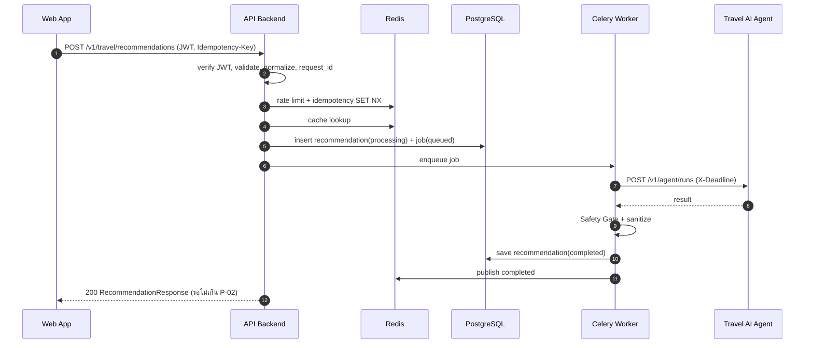
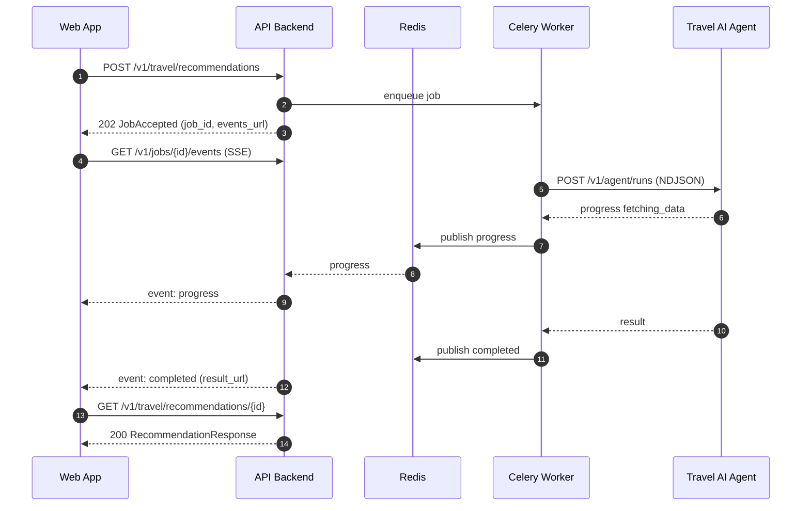
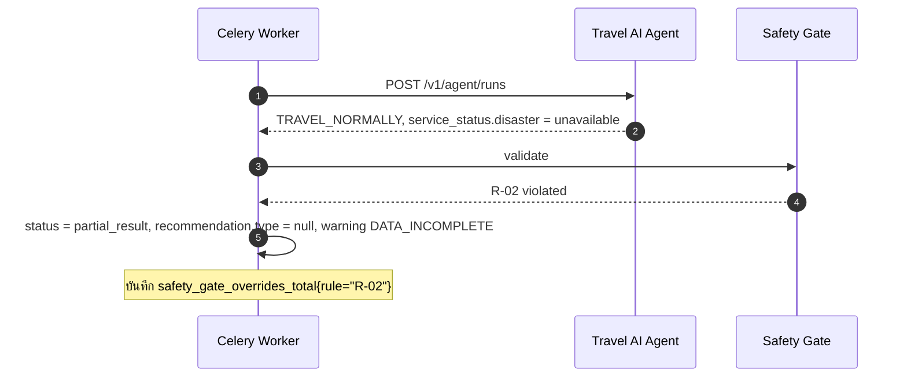

# 02 — API Specification: API & Backend

> สถานะ: **Draft v0.1** — ใช้ค่าที่เสนอไปก่อน ทุกค่าปรับเปลี่ยนได้
> ค่าตัวเลขทั้งหมดรวมไว้ที่ [§2 Tunable Parameters](#2-tunable-parameters) ที่เดียว ส่วนอื่นอ้างอิงเป็นรหัส `P-xx`
> การตัดสินใจที่ยังเปลี่ยนได้บันทึกไว้ที่ [§14 Decision Log](#14-decision-log)
> Requirements อ้างอิง: [01_requirements.md](01_requirements.md)

---

## 1. Conventions

| หัวข้อ | กติกา |
|---|---|
| Base URL | `https://{host}/v1` — version อยู่ใน path; breaking change → `/v2` |
| Format | `application/json; charset=utf-8`, SSE ใช้ `text/event-stream` |
| Field naming | `snake_case` |
| ID | UUIDv7 (เรียงตามเวลาได้) เป็น string |
| เวลา | ISO 8601 UTC ลงท้าย `Z` เช่น `2026-09-17T08:00:00Z`; เวลาท้องถิ่นส่งคู่กับ `timezone` (IANA เช่น `Asia/Bangkok`) |
| ภาษา | BCP-47 (`th`, `en`, `ja`) จาก field `language` หรือ header `Accept-Language` |
| พิกัด | WGS84 (EPSG:4326), `lat` ∈ [-90, 90], `lon` ∈ [-180, 180], ทศนิยมไม่เกิน 6 ตำแหน่ง |
| Geometry | GeoJSON (RFC 7946) — ลำดับ `[lon, lat]` |
| Pagination | Cursor-based: `?limit=20&cursor=...` → `{ "items": [], "next_cursor": "..." \| null }`; `limit` สูงสุด `P-40` |
| Enum | UPPER_SNAKE สำหรับค่าทางธุรกิจ, lower_snake สำหรับ status ทางเทคนิค |
| Nullable | field ที่ไม่มีค่าให้ส่ง `null` ไม่ตัดทิ้ง (contract คงที่) |
| Unknown fields | request ที่มี field ไม่รู้จัก → `422` (`extra="forbid"`) |

### 1.1 Common Request Headers

| Header | บังคับ | คำอธิบาย |
|---|---|---|
| `Authorization: Bearer <jwt>` | ✅ (ยกเว้น public endpoints) | OIDC access token |
| `X-Request-ID` | ❌ | client ส่งมาได้ (UUID); ถ้าไม่ส่ง server สร้างให้ |
| `X-Correlation-ID` | ❌ | ถ้าไม่ส่ง server ใช้ค่าเดียวกับ request_id |
| `Idempotency-Key` | ✅ บน POST ที่สร้าง resource | UUID, อายุ `P-25` |
| `Accept-Language` | ❌ | fallback ของ `language` |

### 1.2 Common Response Headers

| Header | คำอธิบาย |
|---|---|
| `X-Request-ID`, `X-Correlation-ID` | ส่งกลับทุก response |
| `RateLimit-Limit`, `RateLimit-Remaining`, `RateLimit-Reset` | ทุก endpoint ที่มี rate limit |
| `Retry-After` | เมื่อ `429`, `503` |
| `Idempotent-Replayed: true` | เมื่อตอบจาก idempotency cache |
| `Location` | เมื่อ `201` / `202` |

---

## 2. Tunable Parameters

> **ค่าทั้งหมดเป็นข้อเสนอ (Proposed)** — เปลี่ยนที่ตารางนี้ที่เดียว แล้วแก้ config ตาม `Config key`

| ID | Parameter | ค่าเสนอ | Config key |
|---|---|---|---|
| P-01 | Sync response p95 target | 3 s | — (SLO) |
| P-02 | Sync budget ก่อนเปลี่ยนเป็น async | 8 s | `SYNC_AGENT_TIMEOUT_SECONDS` |
| P-03 | Availability target | 99.5 % / เดือน | — (SLO) |
| P-04 | Async job timeout (Agent call ใน worker) | 60 s | `JOB_AGENT_TIMEOUT_SECONDS` |
| P-05 | Job result เก็บใน Redis | 24 h | `JOB_RESULT_TTL_SECONDS` |
| P-06 | Agent connect timeout | 2 s | `AGENT_CONNECT_TIMEOUT_SECONDS` |
| P-07 | Retry ไป Agent (เฉพาะ 502/503/504, connect error) | 2 ครั้ง, backoff 0.5 s × 2ⁿ + jitter | `AGENT_MAX_RETRIES` |
| P-08 | Circuit breaker เปิดเมื่อ | fail 5 ครั้งใน 30 s, ปิดใหม่หลัง 30 s | `AGENT_CB_*` |
| P-10 | Access token lifetime (ตั้งที่ IdP) | 15 min | — |
| P-11 | JWKS cache | 10 min | `JWKS_CACHE_SECONDS` |
| P-20 | ความละเอียดพิกัดใน log | geohash 5 ตัว (~5 km) | `LOG_GEOHASH_PRECISION` |
| P-21 | Retention: request + recommendation | 30 วัน | `RETENTION_RECOMMENDATION_DAYS` |
| P-22 | Retention: conversation messages | 30 วัน | `RETENTION_CONVERSATION_DAYS` |
| P-23 | Retention: feedback (pseudonymous) | 180 วัน | `RETENTION_FEEDBACK_DAYS` |
| P-24 | Retention: audit log | 365 วัน | `RETENTION_AUDIT_DAYS` |
| P-25 | Idempotency-Key TTL | 24 h | `IDEMPOTENCY_TTL_SECONDS` |
| P-26 | Cache TTL ผลแนะนำ (ถ้าข้อมูลยังสด) | 5 min และไม่เกิน `valid_until` | `RECOMMENDATION_CACHE_SECONDS` |
| P-27 | Cache time bucket | 15 min | `CACHE_TIME_BUCKET_MINUTES` |
| P-28 | ข้อมูลถือว่า stale เมื่ออายุเกิน | weather 60 min, disaster 15 min, transport 10 min | `STALE_*_MINUTES` |
| P-30 | Rate limit ต่อ user (ทั้งระบบ) | 60 req/min | `RATE_LIMIT_USER` |
| P-31 | Rate limit ต่อ IP | 120 req/min | `RATE_LIMIT_IP` |
| P-32 | Rate limit: สร้าง recommendation / message | 10 req/min ต่อ user | `RATE_LIMIT_RECOMMEND` |
| P-33 | จำนวน job ที่ค้างพร้อมกันต่อ user | 3 | `MAX_ACTIVE_JOBS_PER_USER` |
| P-34 | SSE/WS connection พร้อมกันต่อ user | 3 | `MAX_STREAMS_PER_USER` |
| P-35 | SSE heartbeat | 15 s | `SSE_HEARTBEAT_SECONDS` |
| P-40 | Page size สูงสุด | 50 | `MAX_PAGE_SIZE` |
| P-41 | ความยาว `question` / message สูงสุด | 1,000 ตัวอักษร | `MAX_QUESTION_CHARS` |
| P-42 | จำนวน waypoints สูงสุด | 5 | `MAX_WAYPOINTS` |
| P-43 | วันเดินทางล่วงหน้าได้สูงสุด | 14 วัน | `MAX_DAYS_AHEAD` |
| P-44 | Request body สูงสุด | 64 KB | `MAX_BODY_BYTES` |
| P-45 | Conversation context ที่ส่งให้ Agent | 10 ข้อความล่าสุด | `AGENT_CONTEXT_MESSAGES` |
| P-46 | Retention: prediction_records (anonymized) | 365 วัน | `RETENTION_PREDICTION_DAYS` |
| P-47 | Retention: trips หลังวันเดินทาง | 30 วัน | `RETENTION_TRIP_DAYS_AFTER_DEPARTURE` |
| P-48 | Geohash precision ใน prediction_records | 5 ตัว (~5 km) | `PREDICTION_GEOHASH_PRECISION` |
| P-49 | อายุไฟล์ data export | 7 วัน | `DATA_EXPORT_TTL_DAYS` |
| P-50 | เวลารัน purge job | 03:00 Asia/Bangkok | `PURGE_CRON`, `PURGE_TIMEZONE` |
| P-51 | ความเชื่อมั่นต่ำกว่านี้ → warning `LOW_CONFIDENCE` | 0.5 | `LOW_CONFIDENCE_THRESHOLD` |
| P-52 | ระยะขั้นต่ำระหว่างต้นทาง/ปลายทาง และระหว่าง waypoint ที่ติดกัน | 50 m | `MIN_ROUTE_DISTANCE_METERS` |
| P-53 | อายุสูงสุดของ SSE connection หนึ่งครั้ง (client ต่อใหม่ด้วย `Last-Event-ID`) | 300 s | `SSE_MAX_STREAM_SECONDS` |
| P-54 | อายุ stream ticket (D-06) | 60 s | `STREAM_TICKET_SECONDS` |
| P-55 | บันทึก trip ล่วงหน้าได้สูงสุด (การประเมินยังใช้ P-43) | 90 วัน | `MAX_TRIP_DAYS_AHEAD` |
| P-56 | รอบ scan trip ที่เปิด live alert (Celery beat) | 15 min | `TRIP_ALERT_SCAN_MINUTES` |
| P-57 | scan เฉพาะ trip ที่ออกเดินทางภายใน | 24 h | `TRIP_ALERT_WINDOW_HOURS` |
| P-58 | ประเมินซ้ำเมื่อผลล่าสุดเก่ากว่า | 60 min | `TRIP_ALERT_REASSESS_MINUTES` |
| P-59 | จำนวน trip สูงสุดต่อการ scan หนึ่งรอบ | 100 | `TRIP_ALERT_BATCH_SIZE` |
| P-60 | รอบของ reaper (job ค้าง + ลบบัญชีที่ค้าง) | 5 min | `REAPER_INTERVAL_MINUTES` |
| P-61 | ลบบัญชีที่ค้างเกินนี้ → ส่งงานลบใหม่ | 10 min | `ACCOUNT_DELETION_RETRY_MINUTES` |
| P-62 | อายุลิงก์ดาวน์โหลด data export (signed URL) | 15 min | `DATA_EXPORT_URL_SECONDS` |
| P-63 | ขอ data export ได้หนึ่งครั้งต่อ | 24 h | `DATA_EXPORT_COOLDOWN_HOURS` |
| P-64 | สถานะ service ที่ Agent รายงานใช้ได้นานเท่านี้ (เกินแล้วเป็น `unknown`) | 15 min | `SERVICE_STATUS_WINDOW_MINUTES` |
| P-65 | Cache ของ `/v1/service-status` | 30 s | `SERVICE_STATUS_CACHE_SECONDS` |
| P-66 | Cache ผลตรวจ Agent `/health` (ใช้ทั้ง `/ready` และ E-23) | 10 s | `READY_AGENT_CACHE_SECONDS` |
| P-67 | ช่วงเวลาสูงสุดของ query admin (jobs, audit log) | 31 วัน | `ADMIN_MAX_RANGE_DAYS` |
| P-68 | อายุไฟล์ training export | 7 วัน | `TRAINING_EXPORT_TTL_DAYS` |
| P-69 | ช่วงเวลาสูงสุดของ training export | 366 วัน | `TRAINING_EXPORT_MAX_RANGE_DAYS` |

---

## 3. Error Model (RFC 9457 Problem Details)

`Content-Type: application/problem+json`

```json
{
  "type": "https://errors.travel-safety.example/rate-limited",
  "title": "Too many requests",
  "status": 429,
  "code": "RATE_LIMITED",
  "detail": "Rate limit reached for this endpoint. Try again later.",
  "instance": "/v1/travel/recommendations",
  "request_id": "0192...",
  "correlation_id": "0192...",
  "errors": null
}
```

- `errors` ใช้เมื่อ `422`: `[{ "field": "origin.lat", "message": "must be between -90 and 90", "code": "out_of_range" }]`
- `detail` เป็นข้อความสำหรับผู้ใช้ ไม่มี stack trace, SQL, URL ภายใน หรือ secret

| HTTP | `code` | เมื่อไร |
|---|---|---|
| 400 | `INVALID_REQUEST` | JSON ผิดรูป, header ผิด |
| 401 | `UNAUTHENTICATED` | ไม่มี token / token หมดอายุ / signature ผิด |
| 403 | `FORBIDDEN` | ไม่มีสิทธิ์ (role/scope) |
| 404 | `NOT_FOUND` | ไม่พบ **หรือเป็นของ user อื่น** (ไม่บอกว่ามีอยู่ — กัน IDOR enumeration) |
| 405 | `METHOD_NOT_ALLOWED` | method ไม่รองรับบน path นี้ |
| 409 | `IDEMPOTENCY_CONFLICT` | key ซ้ำแต่ body ต่าง |
| 409 | `IDEMPOTENCY_IN_PROGRESS` | key เดิมยังประมวลผลไม่เสร็จ |
| 409 | `JOB_NOT_CANCELLABLE` | job จบแล้ว |
| 409 | `REVIEW_NOT_PENDING` | feedback ถูก review ไปแล้ว หรือไม่ต้อง review (§8.2) |
| 413 | `PAYLOAD_TOO_LARGE` | body เกิน `P-44` |
| 415 | `UNSUPPORTED_MEDIA_TYPE` | ไม่ใช่ JSON |
| 422 | `VALIDATION_ERROR` | schema ไม่ผ่าน |
| 422 | `UNSUPPORTED_REGION` | พิกัดอยู่นอกพื้นที่ให้บริการ |
| 429 | `RATE_LIMITED` | + `Retry-After` |
| 429 | `TOO_MANY_ACTIVE_JOBS` | เกิน `P-33` |
| 500 | `INTERNAL_ERROR` | ข้อผิดพลาดที่ไม่คาดคิด |
| 502 | `AGENT_BAD_RESPONSE` | Agent ตอบผิด schema (ตรวจแล้วไม่ผ่าน) |
| 503 | `DEPENDENCY_UNAVAILABLE` | Agent/DB/Redis ล่ม หรือ circuit เปิด + `Retry-After` |
| 504 | `AGENT_TIMEOUT` | เกิน timeout และสร้าง job ไม่ได้ |

> `partial_result` **ไม่ใช่ error** — ตอบ `200` พร้อม `status: "partial_result"` และ `warnings[]` (ดู §5.4)

---

## 4. Endpoint Catalog

| # | Method | Path | Auth | Rate limit | FR |
|---|---|---|---|---|---|
| E-01 | POST | `/v1/travel/recommendations` | user | P-32 | FR-01..13 |
| E-02 | GET | `/v1/travel/recommendations` | user | P-30 | FR-16 |
| E-03 | GET | `/v1/travel/recommendations/{recommendation_id}` | owner | P-30 | FR-09 |
| E-04 | GET | `/v1/jobs/{job_id}` | owner | P-30 | FR-06 |
| E-05 | DELETE | `/v1/jobs/{job_id}` | owner | P-30 | FR-06 |
| E-06 | GET | `/v1/jobs/{job_id}/events` (SSE) | owner | P-34 | FR-07 |
| ~~E-07~~ | ~~GET~~ | ~~`/v1/ws` (WebSocket)~~ | — | — | **Descoped (D-04)** — โจทย์อาจารย์ระบุ "WebSocket/SSE" เป็นทางเลือก ไม่บังคับทั้งคู่; ใช้ SSE (E-06) เป็นช่องทางเดียว |
| E-08 | POST | `/v1/conversations` | user | P-32 | FR-11 |
| E-09 | GET | `/v1/conversations` | user | P-30 | FR-11 |
| E-10 | GET | `/v1/conversations/{conversation_id}` | owner | P-30 | FR-11 |
| E-11 | DELETE | `/v1/conversations/{conversation_id}` | owner | P-30 | FR-16 |
| E-12 | GET | `/v1/conversations/{conversation_id}/messages` | owner | P-30 | FR-11 |
| E-13 | POST | `/v1/conversations/{conversation_id}/messages` | owner | P-32 | FR-11, FR-13 |
| E-14 | POST | `/v1/trips` | user | P-30 | FR-15 |
| E-15 | GET | `/v1/trips` | user | P-30 | FR-15 |
| E-16 | GET / PATCH / DELETE | `/v1/trips/{trip_id}` | owner | P-30 | FR-15 |
| E-17 | POST | `/v1/trips/{trip_id}/assessments` | owner | P-32 | FR-15 |
| E-18 | GET | `/v1/trips/{trip_id}/assessments` | owner | P-30 | FR-15 |
| E-19 | POST | `/v1/recommendations/{recommendation_id}/feedback` | owner | P-30 | FR-14 |
| E-20 | GET / PATCH / DELETE | `/v1/me` | user | P-30 | FR-16 |
| E-21 | POST | `/v1/me/data-export` | user | 1/day | FR-16 |
| E-22 | GET | `/v1/me/data-export/{export_id}` | owner | P-30 | FR-16 |
| E-23 | GET | `/v1/service-status` | public | P-31 | FR-17 |
| E-24 | GET | `/v1/admin/...` (§8) | admin | P-30 | FR-18 |
| E-25 | GET | `/health` | public | — | NFR-10 |
| E-26 | GET | `/ready` | internal | — | NFR-10 |
| E-27 | GET | `/metrics` | internal network only | — | NFR-06 |
| E-28 | GET | `/openapi.json`, `/docs` | public (ปิดได้ใน prod) | — | NFR-09 |

**Scopes (JWT `scope` claim):** `travel:read`, `travel:write`, `profile:read`, `profile:write`, `admin:read`, `admin:write`, `safety:review`

---

## 5. Travel Recommendations

### 5.1 E-01 `POST /v1/travel/recommendations`

**Headers:** `Authorization`, `Idempotency-Key` (บังคับ)
**Query:** `?mode=auto|sync|async` (default `auto`)

#### Request — `TravelRequest`

```json
{
  "origin": {
    "lat": 13.7563, "lon": 100.5018,
    "name": "Bangkok", "place_id": "optional-geocoder-id"
  },
  "destination": {
    "lat": 18.7883, "lon": 98.9853,
    "name": "Chiang Mai", "place_id": null
  },
  "waypoints": [],
  "departure_time": "2026-09-20T01:00:00Z",
  "timezone": "Asia/Bangkok",
  "language": "th",
  "preferences": {
    "travel_modes": ["TRAIN", "BUS"],
    "avoid": ["TOLLS"],
    "max_travel_hours": 12,
    "mobility_needs": ["WHEELCHAIR"],
    "traveler_count": 2
  },
  "question": "ปลอดภัยไหมถ้าเดินทางวันเสาร์นี้",
  "conversation_id": null,
  "trip_id": null
}
```

| Field | Type | บังคับ | Validation |
|---|---|---|---|
| `origin`, `destination` | `Location` | ✅ | lat/lon ในช่วง; `name` ≤ 200 ตัวอักษร; origin ≠ destination |
| `waypoints` | `Location[]` | ❌ | ≤ `P-42` |
| `departure_time` | datetime UTC | ✅ | ตั้งแต่ now − 1 h ถึง now + `P-43` |
| `timezone` | IANA string | ✅ | ต้องอยู่ใน tz database |
| `language` | BCP-47 | ❌ | default จาก `Accept-Language` → `th` |
| `preferences.travel_modes` | enum[] | ❌ | `CAR`, `TRAIN`, `BUS`, `FLIGHT`, `FERRY`, `WALK`, `BICYCLE` |
| `preferences.avoid` | enum[] | ❌ | `TOLLS`, `HIGHWAYS`, `FERRIES`, `NIGHT_TRAVEL` |
| `preferences.max_travel_hours` | int | ❌ | 1–48 |
| `preferences.mobility_needs` | enum[] | ❌ | `WHEELCHAIR`, `ELDERLY`, `CHILDREN`, `PETS` |
| `preferences.traveler_count` | int | ❌ | 1–20 |
| `question` | string | ❌ | ≤ `P-41`, ตัด control chars, trim |
| `conversation_id` | UUID | ❌ | ต้องเป็นของ user |
| `trip_id` | UUID | ❌ | ต้องเป็นของ user |

#### Responses

| Status | เมื่อไร | Body |
|---|---|---|
| `200 OK` | เสร็จภายใน `P-02` | `RecommendationResponse` |
| `202 Accepted` | `mode=async` หรือ `auto` แล้วเกิน budget | `JobAccepted` + `Location: /v1/jobs/{job_id}` |
| `4xx/5xx` | ดู §3 | Problem Details |

`JobAccepted`:

```json
{
  "job_id": "0192...",
  "status": "queued",
  "recommendation_id": "0192...",
  "conversation_id": "0192...",
  "events_url": "/v1/jobs/0192.../events",
  "status_url": "/v1/jobs/0192...",
  "estimated_seconds": 20
}
```

### 5.2 Sync / Async Decision Rule (`mode=auto`)

1. Backend สร้าง recommendation record (`status=processing`) และ job record ไว้ก่อนเสมอ
2. ส่งงานเข้า Celery ทันที แล้วรอผลจาก Redis ไม่เกิน `P-02`
3. เสร็จทัน → `200`; ไม่ทัน → `202` (งานเดิมทำต่อ ไม่ต้องเริ่มใหม่)

> เหตุผล: มี code path เดียว (worker เป็นคนเรียก Agent เสมอ) ทดสอบง่าย และไม่ต้องยกเลิกงาน sync แล้วเริ่ม async ซ้ำ — *ปรับได้ (D-03)*

**รายละเอียดที่ตัดสินใจตอน implement (Step 5.6):**

- ลำดับใน API: normalize → ตรวจเจ้าของ `conversation_id`/`trip_id` (ไม่ใช่ของตัวเอง = `404`) → ตรวจพื้นที่ให้บริการของ origin / destination / waypoints (`422 UNSUPPORTED_REGION` + `errors[]`) → cache → จอง slot งานค้าง (P-33, `429 TOO_MANY_ACTIVE_JOBS` + `Retry-After: 5`) → บันทึก DB → สถานะเริ่มต้นใน Redis → ส่ง Celery
- API รอผลโดยอ่าน event stream ของ job ใน Redis (D-38); job `failed` ภายใน P-02 → ตอบ error ตาม code ของ job (เช่น `502`, `503` + `Retry-After: 5`, `504`)
- `mode=sync` ที่ไม่เสร็จใน P-02 → `504 AGENT_TIMEOUT` แต่ job ยังทำต่อและผลจะอยู่ในประวัติ (D-44)
- Cache ใช้เฉพาะ `auto`/`sync`; `async` สร้าง job เสมอ; ผลใน cache ที่ข้อมูลกลายเป็น stale แล้ว = cache miss (D-45)
- ส่งงานเข้า Celery ไม่ได้ → job `failed` + `503 DEPENDENCY_UNAVAILABLE`
- ทุก recommendation อยู่ใน conversation: ไม่ส่ง `conversation_id` → backend สร้างใหม่ (D-41)

### 5.3 `RecommendationResponse`

```json
{
  "recommendation_id": "0192...",
  "conversation_id": "0192...",
  "request_id": "0192...",
  "status": "completed",
  "created_at": "2026-09-17T08:00:03Z",
  "valid_until": "2026-09-17T09:00:00Z",
  "language": "th",

  "risk": {
    "level": "MEDIUM",
    "score": 0.54,
    "confidence": 0.81,
    "factors": [
      { "type": "WEATHER", "level": "MEDIUM", "description": "ฝนตกหนักช่วงบ่ายในลำปาง" }
    ]
  },

  "recommendation": {
    "type": "CHANGE_ROUTE",
    "summary": "แนะนำเปลี่ยนเส้นทางเลี่ยงทางหลวง 11 ช่วงลำปาง",
    "reasons": ["มีประกาศน้ำท่วมขังบางจุด", "รถไฟขบวน 7 ล่าช้า 40 นาที"],
    "suggested_departure_time": null
  },

  "routes": {
    "primary": { "$ref": "RouteOption" },
    "alternatives": [ { "$ref": "RouteOption" } ]
  },

  "hazards": [
    {
      "hazard_id": "ext-123",
      "type": "FLOOD",
      "severity": "MEDIUM",
      "title": "น้ำท่วมขัง อ.เกาะคา",
      "area": { "type": "Polygon", "coordinates": [] },
      "starts_at": "2026-09-17T06:00:00Z",
      "ends_at": null,
      "source_id": "src-2"
    }
  ],

  "emergency_instructions": null,

  "sources": [
    {
      "source_id": "src-2",
      "name": "Thai Meteorological Department",
      "category": "DISASTER",
      "url": "https://...",
      "retrieved_at": "2026-09-17T07:58:00Z"
    }
  ],

  "data_freshness": {
    "overall_is_stale": false,
    "items": [
      { "category": "WEATHER",   "updated_at": "2026-09-17T07:30:00Z", "age_seconds": 1830, "is_stale": false },
      { "category": "TRANSPORT", "updated_at": "2026-09-17T07:57:00Z", "age_seconds": 180,  "is_stale": false },
      { "category": "DISASTER",  "updated_at": "2026-09-17T07:58:00Z", "age_seconds": 120,  "is_stale": false }
    ]
  },

  "service_status": {
    "weather": "ok",
    "transport": "degraded",
    "disaster": "ok",
    "risk_model": "ok",
    "rag": "ok",
    "llm": "ok"
  },

  "clarification": null,
  "warnings": [],

  "versions": {
    "api": "1.0.0",
    "agent": "0.3.1",
    "risk_model": "risk-lgbm-2026.09.1",
    "prompt": "advice-v4"
  },

  "disclaimer": "คำแนะนำนี้เป็นข้อมูลประกอบการตัดสินใจ โปรดติดตามประกาศจากหน่วยงานทางการ"
}
```

#### Shared Schemas

| Schema | Fields |
|---|---|
| `Location` | `lat`, `lon`, `name?`, `place_id?` |
| `RiskFactor` | `type` (`WEATHER`, `TRANSPORT`, `DISASTER`, `ROUTE`, `TIME_OF_DAY`), `level`, `description` |
| `RouteOption` | `route_id`, `label`, `travel_modes[]`, `distance_km`, `duration_minutes`, `risk_level`, `geometry` (GeoJSON LineString), `legs[]` (`mode`, `from`, `to`, `departure_at`, `arrival_at`, `operator?`, `service_status?`), `restrictions[]`, `tips[]` |
| `Hazard` | `hazard_id`, `type` (`EARTHQUAKE`, `STORM`, `TYPHOON`, `FLOOD`, `WILDFIRE`, `LANDSLIDE`, `HEAVY_RAIN`, `SNOW`, `HEAT`, `OTHER`), `severity`, `title`, `area` (GeoJSON), `starts_at`, `ends_at?`, `source_id` |
| `EmergencyInstructions` | `safety_steps[]`, `contacts[]` (`name`, `phone`, `url?`, `available_hours?`), `nearest_support[]` (`name`, `type` เช่น `SHELTER`, `HOSPITAL`, `POLICE`, `location`), `what_to_do_now` |
| `Source` | `source_id`, `name`, `category` (`WEATHER`, `TRANSPORT`, `DISASTER`, `KNOWLEDGE_BASE`), `url?`, `retrieved_at` |
| `FreshnessItem` | `category`, `updated_at`, `age_seconds`, `is_stale` |
| `ServiceState` | `ok` \| `degraded` \| `unavailable` \| `not_used` |
| `Clarification` | `question`, `missing_fields[]`, `options[]?` |
| `Warning` | `code`, `message` |

#### Enums

| Enum | ค่า |
|---|---|
| `status` | `processing`, `completed`, `partial_result`, `needs_clarification`, `failed`, `cancelled` |
| `risk.level` | `LOW`, `MEDIUM`, `HIGH` |
| `recommendation.type` | `TRAVEL_NORMALLY`, `CHANGE_ROUTE`, `DELAY_TRAVEL`, `AVOID_TRAVEL` |
| `warnings[].code` | `DATA_INCOMPLETE`, `DATA_STALE`, `SERVICE_DEGRADED`, `LOW_CONFIDENCE`, `OUTSIDE_COVERAGE` |

### 5.4 Response Rules (Backend ตรวจก่อนส่ง — Safety Gate)

| # | Rule | การกระทำ |
|---|---|---|
| R-01 | `risk.level = HIGH` แต่ `emergency_instructions = null` | ไม่ส่งคำตอบนั้น → เติม emergency instructions ค่า default ตามภูมิภาค + warning `DATA_INCOMPLETE`; ถ้าไม่มี default → `502 AGENT_BAD_RESPONSE` |
| R-02 | weather หรือ disaster เป็น `unavailable` หรือ `is_stale=true` | ห้าม `TRAVEL_NORMALLY` → `status=partial_result`, `recommendation.type=null`, `summary` บอกว่าข้อมูลไม่ครบ + warning `DATA_INCOMPLETE`/`DATA_STALE` |
| R-03 | dependency อื่น `degraded`/`unavailable` | `status=partial_result` + warning `SERVICE_DEGRADED` (ยังส่ง recommendation ได้ถ้า R-02 ผ่าน) |
| R-04 | `risk.level = HIGH` คู่กับ `TRAVEL_NORMALLY` | ถือว่าขัดแย้ง → `502 AGENT_BAD_RESPONSE` + log เพื่อ safety review |
| R-05 | `status = needs_clarification` | ต้องมี `clarification`; `risk` และ `recommendation` เป็น `null` ได้ |
| R-06 | ทุกคำตอบ | ตัด field ภายใน (prompt, tool trace, cost, internal URL), ตรวจ URL ใน `sources` เป็น `https` เท่านั้น, ตรวจ schema ด้วย Pydantic |
| R-07 | `valid_until` | = ค่าน้อยที่สุดระหว่าง Agent ให้มา และ `min(updated_at) + stale threshold` |

> R-02: เมื่อข้อมูลไม่ครบ `recommendation.type` เป็น `null` แทนการเดา — *ปรับได้ (D-05)*

**รายละเอียดที่ตัดสินใจตอน implement (Step 5.5, `app/domain/safety_gate.py`):**

- ลำดับการตรวจ: สัญญา (Agent `failed`, R-05, R-04) → R-02 → R-03 → R-01 → `LOW_CONFIDENCE`
- R-02 ถือว่า weather/disaster "ไม่มี" เมื่อ service state เป็น `unavailable`, `not_used` หรือไม่ได้รายงาน, หรือ freshness ไม่มี/ไม่มีเวลา → `DATA_INCOMPLETE`; มีเวลาแต่เกินอายุ (P-28) → `DATA_STALE`
- R-02 ทำให้เป็น `null` **เฉพาะ** `TRAVEL_NORMALLY`; คำแนะนำที่ระวังกว่า (`CHANGE_ROUTE`, `DELAY_TRAVEL`, `AVOID_TRAVEL`) คงไว้แต่ status เป็น `partial_result` — *D-34*
- R-03 นับ `degraded` / `unavailable` ของทุก service (`not_used` ไม่นับ)
- `completed` ที่ไม่มี `risk` หรือ `recommendation` → reject ด้วย R-05 (`502`); `partial_result` ไม่มี recommendation ได้
- Agent ตอบ `status = failed` → `503 DEPENDENCY_UNAVAILABLE` — *D-35*
- `risk.confidence < P-51` → warning `LOW_CONFIDENCE` อย่างเดียว ไม่เปลี่ยน status
- R-06 (`app/domain/sanitizer.py`): ข้อความ → NFC, ตัด control / zero-width / bidi-override; URL ต้องเป็น `https` ไม่มี user:password และยาวไม่เกิน 2048; ตัด key `diagnostics`, `prompt(s)`, `tool_trace`, `trace`, `cost`, `debug`, `internal`, `_*`, `internal_*` ทุกระดับ
- R-07 (`app/domain/freshness.py`): เวลาอนาคตเกิน 5 นาที = ไม่น่าเชื่อถือ (stale); `valid_until` ไม่ย้อนหลังกว่าเวลาปัจจุบัน

### 5.5 E-02 / E-03 — History

- `GET /v1/travel/recommendations?limit=&cursor=&from=&to=&risk_level=` → `{ items: RecommendationSummary[], next_cursor }`
  - `RecommendationSummary`: `recommendation_id`, `created_at`, `status`, `risk_level`, `recommendation_type`, `origin_name`, `destination_name`, `departure_time`
- รายละเอียด (Step 5.7): เรียงตาม `created_at` ใหม่สุดก่อน; `from` (รวม) / `to` (ไม่รวม) ต้องมี timezone; `risk_level` ผิด / `limit` นอก 1–P-40 / `cursor` ผิดรูป → `422` พร้อมชื่อ field (D-56)
- `GET /v1/travel/recommendations/{id}` → `RecommendationResponse` (ถ้ายัง `processing` คืน `status=processing` + `job_id`; ถ้า `failed` คืน `error: { code, message }`)

---

## 6. Jobs & Streaming

### 6.1 E-04 `GET /v1/jobs/{job_id}`

```json
{
  "job_id": "0192...",
  "type": "RECOMMENDATION",
  "status": "running",
  "stage": "assessing_risk",
  "progress": 60,
  "created_at": "2026-09-17T08:00:00Z",
  "updated_at": "2026-09-17T08:00:07Z",
  "result_url": "/v1/travel/recommendations/0192...",
  "error": null
}
```

- `type`: `RECOMMENDATION`, `MESSAGE`, `TRIP_ASSESSMENT`, `DATA_EXPORT`
- `status`: `queued`, `running`, `succeeded`, `failed`, `cancelled`
- `stage`: `queued` → `fetching_data` → `assessing_risk` → `generating_advice` → `completed` \| `failed`
- `error` (เมื่อ failed): `{ "code": "AGENT_TIMEOUT", "message": "..." }`

### 6.2 E-05 `DELETE /v1/jobs/{job_id}`

- `202` → กำลังยกเลิก (ส่ง revoke ให้ Celery + cancel ไป Agent)
- `409 JOB_NOT_CANCELLABLE` ถ้าจบแล้ว

**รายละเอียดที่ตัดสินใจตอน implement (Step 5.9a):**

- scope `travel:write`; job ของคนอื่น → `404`; ตอบ `202` พร้อม `JobResponse` (`status = cancelled`)
- ยกเลิกใน DB ทันที (job + recommendation เป็น `cancelled`), ส่ง event `cancelled` (terminal), คืน slot P-33; ไม่ใช้ Celery revoke — worker ข้าม job ที่ไม่ active ตอนเริ่ม และระหว่างรอ Agent จะตรวจ DB ทุก 1 วินาทีแล้วส่ง `DELETE /runs/{id}` ไปที่ Agent — *D-72*
- ผลที่มาถึงหลังยกเลิก (หรือหลัง reaper ปิด job) ถูกทิ้ง; สถานะใน Redis ไม่ย้อนกลับจาก terminal — *D-73*
- **Reaper** (beat ทุก P-60, queue `maintenance`): job `queued`/`running` ที่เก่ากว่า P-04 × 2 → `failed` + `AGENT_TIMEOUT` และส่ง event `failed` — *D-74*

### 6.3 E-06 `GET /v1/jobs/{job_id}/events` (SSE)

- รองรับ `Last-Event-ID` เพื่อ resume — `id` เป็นค่า opaque (Redis Stream entry id) client ห้ามตีความ
- heartbeat comment `: ping` ทุก `P-35`
- ปิด stream หลัง event `completed` / `failed` / `cancelled`
- ถ้า client ส่ง token ผ่าน header ไม่ได้ (EventSource) → ใช้ **short-lived stream ticket**: `POST /v1/jobs/{job_id}/stream-ticket` → `{ ticket, expires_in: 60 }` แล้วเรียก `?ticket=` (ไม่ใส่ JWT ใน URL) — *D-06*
- ticket ใช้ได้ครั้งเดียว ผูกกับ job นั้น (ใช้กับ job อื่น / ซ้ำ / หมดอายุ → `401`); เก็บใน Redis เป็น hash ของ ticket (D-40)
- เปิด stream พร้อมกันเกิน P-34 → `429 RATE_LIMITED`; stream ปิดเองหลัง P-53 (client ต่อใหม่ด้วย `Last-Event-ID`)
- event ของ job ที่หมดอายุใน Redis แล้วแต่ job จบแล้ว → ส่ง event สุดท้ายหนึ่งตัวจาก DB (ไม่มี `id:`)
- `data` ของทุก event มี `job_id`; `progress.message` สร้างโดย backend ตามภาษาของ request (D-49)
- Header ของ response: `Content-Type: text/event-stream`, `Cache-Control: no-store`, `X-Accel-Buffering: no`

```text
id: 3
event: progress
data: {"job_id":"0192...","stage":"assessing_risk","progress":60,"message":"กำลังประเมินความเสี่ยง","at":"2026-09-17T08:00:07Z"}

id: 5
event: completed
data: {"job_id":"0192...","status":"completed","result_url":"/v1/travel/recommendations/0192..."}
```

| `event` | data |
|---|---|
| `progress` | `stage`, `progress` (0–100), `message` (ตาม language) |
| `partial` | ส่วนของผลลัพธ์ที่พร้อมแล้ว เช่น `hazards` (optional, ขึ้นกับ Agent) |
| `completed` | `status` (`completed`/`partial_result`/`needs_clarification`), `result_url` |
| `failed` | `error.code`, `error.message` |
| `cancelled` | — |

### 6.4 ~~E-07 `WS /v1/ws`~~ — Descoped (D-04)

โจทย์อาจารย์ (`02_step.txt` บรรทัด 4) เขียนว่ารับ request ผ่าน "WebSocket/**SSE**" คือให้เลือกช่องทางเดียว
ไม่ได้บังคับทั้งคู่ ทีมเลือก **SSE เป็นช่องทางเดียว** (E-06) เพื่อลดความเสี่ยงก่อนส่งงาน — ดูเหตุผลเต็มที่ D-04

ร่าง protocol เดิม (auth handshake, `subscribe`/`unsubscribe`, close code `4401`/`4403`/`4429`/`1011`)
เก็บไว้เป็นข้อมูลอ้างอิงเผื่อทำต่อหลังส่งงาน แต่ **ไม่ implement ในรอบนี้**

Live trip alert (ของเดิมที่ WS จะมาช่วย) ใช้ **polling `GET /v1/conversations/{id}/messages`
แทน** — alert ถูกเขียนเป็นข้อความ assistant ใน conversation ของ trip นั้นอยู่แล้วจาก `scan_trip_alerts`
(ดู §7.2) จึงไม่ต้องมี push channel เพิ่มเพื่อให้ฟีเจอร์นี้ใช้งานได้ครบ

---

## 7. Conversations, Trips, Feedback, Me

### 7.1 Conversations (E-08 .. E-13)

- `POST /v1/conversations` body `{ "title?": "...", "language?": "th" }` → `201 Conversation`
- `Conversation`: `conversation_id`, `title`, `language`, `created_at`, `updated_at`, `last_recommendation_id`, `message_count`
- `POST /v1/conversations/{id}/messages` (ต้องมี `Idempotency-Key`)

```json
{
  "content": "ถ้าออกเดินทางช้ากว่าเดิม 3 ชั่วโมงล่ะ",
  "overrides": { "departure_time": "2026-09-20T04:00:00Z" },
  "stream": true
}
```

  - `overrides` ใช้ field ย่อยของ `TravelRequest` (partial) ร่วมกับ request ล่าสุดของ conversation
  - ถ้ามี override ด้าน route/time → Backend สั่งประเมินความเสี่ยงใหม่เสมอ (ตาม Module 08 ข้อ 10)
  - Response: `200 Message` หรือ `202 JobAccepted` (กติกาเดียวกับ §5.2); ถ้า `stream=true` ใช้ `events_url`
- `Message`: `message_id`, `role` (`user` \| `assistant`), `content`, `recommendation_id?`, `created_at`
- `GET .../messages?limit=&cursor=` → เรียงใหม่สุดก่อน
- `DELETE /v1/conversations/{id}` → `204` (ลบ messages + unlink recommendations)

**รายละเอียดที่ตัดสินใจตอน implement (Step 5.7):**

- `POST /v1/conversations` และ `POST .../messages` ใช้ rate limit P-32 และต้องมี `Idempotency-Key`; ตอบ `201` + `Location` / `200` / `202`
- `title` ตัด control chars และตัดเหลือ 200 ตัวอักษร; ว่าง → `null`; `language` เลือกจาก body → `Accept-Language` → `th`
- follow-up = คำขอคำแนะนำใหม่ (`travel_requests.source = MESSAGE`, `jobs.type = MESSAGE`) จาก request ล่าสุดของ conversation + `overrides`; ไม่ใช้ cache และส่ง 10 ข้อความล่าสุด (P-45) เป็น context — *D-53*
- `overrides`: field ที่ไม่ส่งหรือเป็น `null` = ใช้ค่าเดิม; `preferences` รวมทีละ key; `waypoints: []` = ล้าง waypoint; conversation ที่ยังไม่มี request ต้องส่ง `origin`, `destination`, `departure_time`, `timezone` ไม่งั้น `422` (`overrides`, `travel_context_required`) — *D-54*
- error ของ field ใน follow-up ใช้ชื่อ `content` (ข้อความ) และ `overrides.<field>` (เช่นเวลาเดิมผ่านไปแล้ว → `overrides.departure_time`)
- `stream=true` → ตอบ `202` เสมอ; `stream=false` → เหมือน `mode=auto` (`200 Message` ของ assistant หรือ `202`) — *D-52*
- job ที่จบแล้วบันทึกข้อความ assistant เสมอ (summary, คำถามกลับ หรือข้อความ "ข้อมูลไม่พอ") — *D-55*
- ลบ conversation ระหว่างที่ follow-up แบบ sync ยังทำงาน → `404`
- list conversations เรียงตาม `updated_at` ใหม่สุดก่อน (D-57); messages เรียงตาม `created_at` ใหม่สุดก่อน

### 7.2 Trips (E-14 .. E-18)

```json
{
  "name": "เชียงใหม่ ก.ย.",
  "origin": { "lat": 13.7563, "lon": 100.5018, "name": "Bangkok" },
  "destination": { "lat": 18.7883, "lon": 98.9853, "name": "Chiang Mai" },
  "departure_time": "2026-09-20T01:00:00Z",
  "timezone": "Asia/Bangkok",
  "preferences": {},
  "alerts": { "enabled": true, "consent_at": "2026-09-17T08:00:00Z", "channels": ["IN_APP"] }
}
```

- `Trip` = body + `trip_id`, `status` (`PLANNED`, `ACTIVE`, `COMPLETED`, `CANCELLED`), `last_assessment`, `created_at`, `updated_at`
- `PATCH /v1/trips/{id}` → ใช้ JSON Merge Patch; เปลี่ยน route/time → `last_assessment` ถูก mark `outdated`
- `POST /v1/trips/{id}/assessments` → เหมือน E-01 แต่ใช้ข้อมูลจาก trip (`200` / `202`)
- Live alert ส่งเฉพาะเมื่อ `alerts.enabled=true` และมี `consent_at`

**รายละเอียดที่ตัดสินใจตอน implement (Step 5.8):**

- `POST /v1/trips` ต้องมี `Idempotency-Key` → `201 Trip` + `Location`; `name` ตัด control chars, ไม่ว่าง, ≤ 100 ตัวอักษร; route/เวลา/preferences ตรวจแบบเดียวกับ E-01 แต่ `departure_time` ล่วงหน้าได้ถึง P-55 (P-43 ใช้ตอนประเมิน) — *D-59*
- เปิด alert ต้องส่ง `alerts.consent_at`; server บันทึกเวลาของ server เป็นเวลายินยอม; ปิด alert → `consent_at = null`; `channels` ตอนนี้มีแค่ `IN_APP` (ไม่ว่าง ไม่ซ้ำ) — *D-62*
- `GET /v1/trips?limit=&cursor=&status=` เรียงตาม `departure_time` ล่าสุดก่อน
- `PATCH` (`application/merge-patch+json` หรือ `application/json`): `origin`/`destination`/`waypoints` แทนทั้งก้อน, `preferences`/`alerts` รวมทีละ key; `null` = ลบค่า (`waypoints`, `preferences`, `preferences.max_travel_hours`, ...) แต่ field บังคับ (`name`, `origin`, `destination`, `departure_time`, `timezone`, `status`, `alerts.enabled`, `alerts.channels`) เป็น `null` → `422 required`; ตรวจ `departure_time` เฉพาะเมื่อส่งมา — *D-60*
- `status`: `PLANNED → ACTIVE/COMPLETED/CANCELLED`, `ACTIVE → COMPLETED/CANCELLED`; trip ที่ `COMPLETED`/`CANCELLED` แก้หรือประเมินไม่ได้ (`422`, `status`, `trip_closed`); ย้ายผิดทาง → `invalid_transition` — *D-61*
- เปลี่ยน origin / destination / waypoints / departure_time / preferences → `last_assessment.outdated = true`; ผลประเมินที่ request ตรงกับ trip ปัจจุบันจึงล้าง `outdated` — *D-64*
- `last_assessment` = `{recommendation_id, status, risk_level, recommendation_type, created_at, outdated}` ของผลประเมินล่าสุดที่จบแล้ว (job ที่ fail ไม่เปลี่ยน)
- `POST /v1/trips/{id}/assessments` (`Idempotency-Key`, P-32) body `{ "mode?": "auto|sync|async", "language?": "th" }`; ภาษา: body → `Accept-Language` → ภาษาใน profile; ใช้ conversation เดิมของ trip (ครั้งแรกสร้างใหม่); `travel_requests.source = TRIP_ASSESSMENT`, `jobs.type = TRIP_ASSESSMENT` — *D-63*
- `GET /v1/trips/{id}/assessments?limit=&cursor=` → `{items: RecommendationSummary[], next_cursor}` ใหม่สุดก่อน
- `DELETE` → `204`; ผลประเมินยังอยู่ใน history (`trip_id = null`)
- **Live alert** (D-65, D-66): Celery beat สั่ง `scan_trip_alerts` ทุก P-56 → คิวประเมินใหม่แบบ async (`source = TRIP_ALERT`) ให้ trip ที่เปิด alert, สถานะ `PLANNED`/`ACTIVE`, ออกเดินทางภายใน P-57, ผลล่าสุดไม่มี / outdated / เก่ากว่า P-58 และไม่มีการประเมินที่ค้างอยู่ (สูงสุด P-59 ต่อรอบ; user ที่ชน P-33 ข้ามไปรอบหน้า); alert แบบ in-app คือข้อความ assistant ใน conversation ของ trip ซึ่งบันทึกเฉพาะเมื่อระดับความเสี่ยงหรือชนิดคำแนะนำเปลี่ยนจากครั้งก่อน; ไม่ push (WS descoped, D-04) — client อ่านด้วยการ poll `GET /v1/conversations/{id}/messages`

### 7.3 E-19 Feedback

`POST /v1/recommendations/{recommendation_id}/feedback` (ต้องมี `Idempotency-Key`)

```json
{
  "rating": 4,
  "helpful": true,
  "outcome": "FOLLOWED",
  "report_type": null,
  "comment": "ข้อมูลรถไฟตรงดี"
}
```

| Field | Validation |
|---|---|
| `rating` | 1–5, optional |
| `helpful` | bool, optional |
| `outcome` | `FOLLOWED`, `IGNORED`, `CHANGED_PLAN`, `UNKNOWN` |
| `report_type` | `null` \| `UNSAFE_ADVICE` \| `INCORRECT_INFO` \| `OUTDATED_INFO` \| `OTHER` |
| `comment` | ≤ 1,000 ตัวอักษร |

- `201` → `{ feedback_id, created_at, review_status }`
- `report_type = UNSAFE_ADVICE` หรือ `INCORRECT_INFO` → เข้า safety review queue (`review_status=pending`) และแจ้ง Ops
- Feedback เก็บแยกจาก telemetry, ผูกกับ pseudonymous user id; ใช้ retrain ได้ **หลัง review เท่านั้น**

**รายละเอียดที่ตัดสินใจตอน implement (Step 5.8):**

- scope `travel:write`, rate limit P-30, ต้องมี `Idempotency-Key`; recommendation ของคนอื่นหรือไม่มีอยู่ → `404`
- recommendation ที่ยัง `processing` → `422` (`recommendation_id`, `not_finished`); ต้องมีอย่างน้อยหนึ่งอย่างใน `rating`, `helpful`, `report_type`, `comment` หรือ `outcome` ที่ไม่ใช่ `UNKNOWN` ไม่งั้น `422` (`feedback`, `feedback_empty`); ส่งได้หลายครั้งต่อ recommendation — *D-67*
- `comment` ตัด control chars; ว่าง → `null`; เกิน 1,000 → `422 too_long`; `outcome` default `UNKNOWN`
- "แจ้ง Ops" = log event ระดับ warning `safety_review_requested` (มีแค่ feedback id, recommendation id, report type — ไม่มีข้อความ) + audit log `feedback.report` + metric `safety_review_requested_total{report_type}` (Step 5.10); alert rule เป็นของทีม monitoring (`08_monitoring`) — *D-68*

### 7.4 Me (E-20 .. E-22)

- `GET /v1/me` → `{ user_id, display_name, email_masked, language, timezone, home_region, consents: { live_alerts, analytics }, created_at }`
- `PATCH /v1/me` → แก้ `display_name`, `language`, `timezone`, `home_region`, `consents`
- `DELETE /v1/me` → `202` ลบข้อมูลทั้งหมดแบบ async (feedback ที่ anonymize แล้วเก็บต่อได้)
- `POST /v1/me/data-export` → `202 { export_id, status }`; `GET /v1/me/data-export/{id}` → `{ status, download_url?, expires_at? }` (signed URL อายุสั้น)

**รายละเอียดที่ตัดสินใจตอน implement (Step 5.9a; export อยู่ใน 5.9b):**

- scope: `GET` ใช้ `profile:read`, `PATCH`/`DELETE` ใช้ `profile:write` — *D-80*
- `email_masked` มาจาก claim `email` ใน token (`s***@example.com`) ไม่เก็บลง DB; ไม่มี claim → `null`
- `PATCH` เป็น merge patch (`application/merge-patch+json` หรือ JSON): `display_name` ≤ 100 (`null` = ลบ), `language` = `th`/`en`, `timezone` = IANA, `home_region` = ISO 3166 เช่น `TH`, `TH-50` (`null` = ลบ), `consents.live_alerts` / `consents.analytics` = bool; `null` บน `language`, `timezone`, `consents.*` → `422 required` — *D-76*
- เปิด consent → server บันทึกเวลา, ปิด → ล้างเวลา; ทุกครั้งที่ consent เปลี่ยนเขียน audit `user.consent` — *D-76*
- consent `live_alerts` เป็นสวิตช์หลัก: เปิด alert ของ trip ก็บันทึก consent นี้ด้วย; ถอน consent → ปิด alert ทุก trip; scan ต้องมีทั้งสองอย่าง — *D-77*
- consent `analytics` = อนุญาตให้เขียน `prediction_records` (D-13, D-75)
- `DELETE /v1/me` → `202 {"status": "deleting"}`: ตั้ง `deleted_at`, ยกเลิก job ที่ค้าง, ลบข้อมูลของ user ใน Redis (job, stream, คำตอบ idempotency ที่เก็บไว้), audit `user.delete_requested`, ส่งงาน `delete_account` เข้า queue `maintenance`; ระหว่างรอลบ ทุก request ของ user นี้ได้ `403 FORBIDDEN` ("This account is being deleted."); ถ้ายังไม่ลบภายใน P-61 reaper ส่งงานใหม่ — *D-78*
- หลังลบเสร็จ การ login ด้วย `sub` เดิมจะได้บัญชีใหม่ที่ว่างเปล่า

**Data export (Step 5.9b):**

- `POST /v1/me/data-export` (`profile:read`, ต้องมี `Idempotency-Key`) → `202 {export_id, status}` + `Location`; ขอได้ครั้งเดียวต่อ P-63 ไม่งั้น `429 RATE_LIMITED` + `Retry-After` — *D-83*
- `GET /v1/me/data-export/{id}` → `{export_id, status, created_at, completed_at, expires_at, download_url}`; `status` = `queued` / `running` / `ready` / `failed` / `expired`; `download_url` เป็น signed URL อายุ P-62 มีเฉพาะตอน `ready` และยังไม่หมดอายุ; export ของคนอื่น → `404` — *D-82*
- ไฟล์เป็น zip ที่มี `travel-safety-data.json` (profile, conversations + messages, trips, recommendations พร้อม request, feedback); เก็บ P-49 แล้ว purge ลบไฟล์และตั้ง `expired`
- ถ้าระบบไม่ได้ตั้ง object storage → `503 DEPENDENCY_UNAVAILABLE` — *D-84*

---

## 8. Service Status & Admin

### 8.1 E-23 `GET /v1/service-status` (public, cache P-65)

```json
{
  "status": "degraded",
  "updated_at": "2026-09-17T08:00:00Z",
  "components": {
    "api": "ok", "agent": "ok",
    "weather": "ok", "transport": "degraded", "disaster": "ok",
    "risk_model": "ok", "rag": "unknown", "llm": "ok"
  },
  "message": "บางบริการทำงานไม่เต็มที่ คำแนะนำอาจมีข้อมูลไม่ครบ"
}
```

> ไม่เปิดเผยชื่อ provider, host, error ภายใน

**รายละเอียด (ทำใน Step 5.10)** — *D-87, D-88*

- ไม่ต้อง login; ใช้ IP rate limit (P-31); `Cache-Control: public, max-age=P-65`, `Vary: Accept-Language`; `message` เป็นภาษาไทยหรืออังกฤษตาม `Accept-Language`
- ค่าของแต่ละ component: `ok` / `degraded` / `unavailable` / `unknown`
- `agent`: circuit breaker เปิด → `unavailable`; Agent `/health` ไม่ตอบ (cache P-66) → `unavailable`; ครึ่งเปิด → `degraded`
- `weather`, `transport`, `disaster`, `risk_model`, `rag`, `llm`: backend ไม่เรียก provider เอง (D-03) จึงใช้สถานะล่าสุดที่ Agent รายงานใน `service_status` ของคำตอบ (worker บันทึกทุกครั้งที่ได้คำตอบ); ไม่มีรายงานภายใน P-64 หรือรายงานเป็น `not_used` → `unknown` (ไม่แสดงว่า `ok`)
- `status` รวม: agent `unavailable` → `unavailable`; มี component `degraded`/`unavailable` → `degraded`; มี `unknown` → `unknown`; นอกนั้น `ok`
- Redis cache ใช้ไม่ได้ → ยังตอบได้ แต่ข้อมูลบริการทั้งหมดเป็น `unknown`

### 8.2 Admin (Could — ทำหลัง core flow)

| Method | Path | Scope |
|---|---|---|
| GET | `/v1/admin/jobs?status=&type=&from=&to=&limit=&cursor=` | `admin:read` |
| GET | `/v1/admin/recommendations/{id}` (มี versions + trace id) | `admin:read` |
| GET | `/v1/admin/feedback/reviews?status=pending` | `safety:review` |
| PATCH | `/v1/admin/feedback/reviews/{feedback_id}` `{ status: approved\|rejected, note }` | `safety:review` |
| GET | `/v1/admin/audit-logs?action=&actor_type=&result=&target_type=&target_id=&from=&to=` | `admin:read` |
| POST | `/v1/admin/exports/training-data` `{from?, to?}` (ต้องมี `Idempotency-Key`) | `admin:write` |
| GET | `/v1/admin/exports/training-data/{export_id}` | `admin:write` |

ทุก admin action บันทึก audit log: `actor_id`, `action`, `target`, `at`, `correlation_id`

**รายละเอียด (ทำใน Step 5.11)** — *D-92..D-95*

- ช่วงเวลา `[from, to)` (ISO 8601 ต้องมี timezone): ไม่ส่ง `to` = ตอนนี้, ไม่ส่ง `from` = `to` − 24 ชั่วโมง (training export: − 30 วัน); ยาวเกิน P-67 (training export: P-69) หรือ `from ≥ to` → `422 VALIDATION_ERROR`
- รายการเรียงใหม่สุดก่อน + cursor (`limit` ≤ P-40); cursor ของ audit log ใช้ id ตัวเลข
- `jobs` → `{items: [{job_id, type, status, stage, attempts, error_code, recommendation_id, cancel_requested, created_at, started_at, finished_at}], next_cursor}`
- `recommendations/{id}` → `{recommendation_id, source, status, risk_level, risk_score, risk_confidence, recommendation_type, warning_codes, safety_gate_rules, overall_is_stale, error_code, versions, data_freshness[{category, updated_at, age_seconds, is_stale}], service_status, created_at, completed_at, valid_until, job, agent_runs[{run_id, attempt, status, http_status, error_code, duration_ms, tool_calls, agent_version, trace_id, started_at, finished_at}]}`; ไม่มี → `404`
- admin เห็นเฉพาะ diagnostics: **ไม่มี** `user_id`, ชื่อสถานที่, พิกัด, คำถาม หรือ payload ของคำตอบ (D-94); audit log ไม่แสดง `ip_hash`
- `audit-logs` → `{items: [{id, occurred_at, actor_type, actor_ref, action, target_type, target_id, result, correlation_id, metadata}], next_cursor}`; `action` รับ `[a-z0-9_.]`, `target_type` รับ `[a-z0-9_]`, `target_id` ต้องมากับ `target_type`
- training export: `202 {export_id, status}` + `Location`; GET → `{export_id, status, from, to, row_count, created_at, completed_at, expires_at, download_url}`; ไฟล์ gzip JSON Lines อายุ P-68 ลิงก์อายุ P-62; หนึ่งบรรทัดต่อ prediction record (anonymized, เฉพาะผู้ใช้ที่ยินยอม analytics) พร้อม feedback ที่ reviewer approve แล้วเท่านั้น (rating, helpful, outcome, report_type — ไม่มี comment) — D-92; ส่งเข้า queue ไม่ได้ → `503`; ไม่ได้ตั้ง object storage → `503`
- audit action: `admin.jobs_list`, `admin.recommendation_read`, `admin.audit_logs_list`, `export.training_data`, `export.training_data_read` (`success` / `error` เมื่อไม่พบหรือส่งงานไม่ได้); token ถูกต้องแต่ขาด scope → `403` + audit `denied` พร้อม `metadata.required_scope` (รวม review queue) — D-95

**Review queue (ทำใน Step 5.8, ส่วน admin อื่นทำใน 5.11)** — *D-69, D-70*

- `status` ใช้ค่าเดียวกับ `review_status`: filter `pending` (default) / `not_required` / `approved` / `rejected`; PATCH รับ `approved` หรือ `rejected` (ร่างเดิมเขียนเป็นตัวพิมพ์ใหญ่)
- `GET` เรียงเก่าสุดก่อน (FIFO) + cursor → `{items: [{feedback_id, recommendation_id, rating, helpful, outcome, report_type, comment, review_status, review_note, reviewed_at, created_at, recommendation}], next_cursor}`; `recommendation` คือ payload ที่ sanitize แล้ว (`null` ถ้าถูกลบไปแล้ว)
- `PATCH` body `{ "status": "approved", "note?": "..." }` (note ≤ 1,000) → item เดิม (ไม่มี `recommendation`); review ได้เฉพาะ `pending` ไม่งั้น `409 REVIEW_NOT_PENDING`; `approved` → `usable_for_training = true`
- audit: `feedback.review_list` (ทุกครั้งที่เปิดคิว), `feedback.review` (`success` / `denied`); `actor_ref` = `sub` ของ reviewer, `ip_hash` = HMAC ของ IP

---

## 9. Agent Contract (Backend → Travel AI Agent)

> ต้องตกลงกับ Module 03 — *D-07*

### 9.1 Transport & Auth

- `POST {AGENT_SERVICE_URL}/v1/agent/runs`
- Service auth: OAuth2 client credentials (JWT `aud=travel-agent`) — dev ใช้ shared token; prod พิจารณา mTLS
- Headers: `X-Request-ID`, `X-Correlation-ID`, `traceparent` (W3C), `X-Deadline` (ISO 8601 — Agent ต้องหยุดก่อนเวลานี้)
- Cancellation: `DELETE {AGENT_SERVICE_URL}/v1/agent/runs/{run_id}` หรือปิด connection

### 9.2 Request

```json
{
  "run_id": "0192...",
  "intent_hint": "CHECK_SAFETY",
  "request": { "...": "TravelRequest ที่ normalize แล้ว (ไม่มี PII)" },
  "context": {
    "conversation_id": "0192...",
    "messages": [ { "role": "user", "content": "..." } ],
    "previous_recommendation_id": null
  },
  "user_profile": { "pseudonymous_id": "u_7f3a...", "language": "th", "home_region": "TH" },
  "limits": { "deadline_at": "2026-09-17T08:01:00Z", "max_tool_calls": 20 }
}
```

- Backend **ไม่ส่ง** email, ชื่อจริง, token ของผู้ใช้ ไปที่ Agent
- `context.messages` จำกัด `P-45` ข้อความ และ mark เป็น untrusted data

### 9.3 Progress (optional)

- ถ้า Agent รองรับ: `Accept: application/x-ndjson` → Agent stream บรรทัด `{"type":"progress","stage":"fetching_data","progress":20,"message":"..."}` และบรรทัดสุดท้าย `{"type":"result", ...AgentRunResponse}`
- ถ้าทำงานต่อไม่ได้: บรรทัด `{"type":"error","code":"...","message":"..."}` — code `TIMEOUT` / `DEADLINE_EXCEEDED` / `BUDGET_EXCEEDED` → `504`, code อื่น (รวม `CANCELLED`) → `503`
- `stage` ใช้ค่าเดียวกับ job stage (§6.1); `progress` 0–100
- Backend เลือกจาก `Content-Type` ของ response: ถ้า Agent ตอบ JSON ธรรมดาแม้ขอ NDJSON ก็รับได้
- ถ้าไม่รองรับ: Backend ส่ง progress แบบประมาณเวลาเอง (`queued` → `fetching_data` เท่านั้น) จนได้ผล
- ขนาด response/stream รวมไม่เกิน `AGENT_MAX_RESPONSE_BYTES` (5 MB) — เกิน → `502`

### 9.4 Response

```json
{
  "run_id": "0192...",
  "status": "completed",
  "risk": { "level": "MEDIUM", "score": 0.54, "confidence": 0.81, "factors": [] },
  "recommendation": { "type": "CHANGE_ROUTE", "summary": "...", "reasons": [], "suggested_departure_time": null },
  "routes": { "primary": {}, "alternatives": [] },
  "hazards": [],
  "emergency_instructions": null,
  "sources": [],
  "data_freshness": { "items": [] },
  "service_status": {},
  "clarification": null,
  "valid_until": "2026-09-17T09:00:00Z",
  "versions": { "agent": "0.3.1", "risk_model": "...", "prompt": "..." },
  "diagnostics": { "tool_calls": 7, "duration_ms": 6400, "trace_id": "..." }
}
```

- `diagnostics` เก็บเข้า DB/trace เท่านั้น **ไม่ส่งให้ผู้ใช้** (R-06)
- Backend คำนวณ `is_stale` และ `age_seconds` เองจาก `updated_at` + `P-28` ไม่เชื่อค่าจาก Agent

### 9.5 Error Mapping

| Agent ตอบ | Backend ทำ |
|---|---|
| `200` + schema ถูก | ผ่าน Safety Gate (§5.4) |
| `200` + schema ผิด | `502 AGENT_BAD_RESPONSE` (ไม่ retry) |
| `400/422` | log + `500 INTERNAL_ERROR` (เป็น bug ฝั่ง Backend) |
| `429`, `502`, `503`, connect error | retry ตาม `P-07` → ถ้ายังไม่ได้ `503 DEPENDENCY_UNAVAILABLE` |
| timeout / เกิน `X-Deadline` | sync: เปลี่ยนเป็น async (§5.2); async: job `failed` + `AGENT_TIMEOUT` |
| circuit breaker เปิด | `503 DEPENDENCY_UNAVAILABLE` + `Retry-After` ทันที |
| `401` / `403` จาก Agent | `500 INTERNAL_ERROR` (service credential ผิด — ปัญหาฝั่งเรา) |
| `500` | `503 DEPENDENCY_UNAVAILABLE` (ไม่ retry) |
| `run_id` ใน response ไม่ตรง | `502 AGENT_BAD_RESPONSE` |

**Retry:** 429 / 408 / 502 / 503 / 504 / connect error / connect timeout เท่านั้น, สูงสุด `P-07` ครั้ง, backoff `0.5 s × 2ⁿ⁻¹ + jitter(0–0.5 s)` หรือ `Retry-After` ถ้ามากกว่า และไม่ retry ถ้ารอแล้วจะเกิน deadline

**Circuit breaker (P-08):** นับเฉพาะ timeout, connect error และ 5xx/429; `4xx` และ schema ผิดไม่นับ (Agent ยังตอบได้); ครึ่งเปิดให้ probe ได้ครั้งละ 1 request; state อยู่ใน Redis `cb:agent` ใช้ร่วมทุก process

**Cancel:** ถ้า caller ถูก cancel (job ถูกยกเลิก / shutdown) client ส่ง `DELETE /v1/agent/runs/{run_id}` ให้อัตโนมัติ; Agent ตอบ `202` หรือ `404` (ไม่รู้จัก run) ถือว่าสำเร็จ

---

## 10. Health & Operations

| Endpoint | Response | ตรวจอะไร |
|---|---|---|
| `GET /health` | `200 {"status":"ok"}` | process ยังทำงาน (ไม่เช็ค dependency) |
| `GET /ready` | `200` / `503` + `{"status":"ready","checks":{"database":"ok","redis":"ok","redis_cache":"ok","agent":"ok"}}` | DB `SELECT 1`, Redis core/cache `PING`, Agent `/health` (cache P-66); timeout 2 s ต่อ check |
| `GET /metrics` | Prometheus text | เปิดเฉพาะ network ภายใน |

**รายละเอียด (ทำใน Step 5.10)**

- `/ready` เป็น `503` (`status: not_ready`) เมื่อ `database` หรือ `redis` (core) ใช้ไม่ได้เท่านั้น; `redis_cache` และ `agent` รายงานอย่างเดียว เพราะทุก replica ใช้ร่วมกัน ถอดทุก pod ออกจาก load balancer ไม่ช่วยอะไร — *D-87*
- ค่าใน `checks` มีแค่ `ok` / `unavailable` (ไม่มี host หรือข้อความ error); ไม่ได้ตั้ง Agent → ไม่มี key `agent`
- `/ready` และ `/metrics` ตอบเฉพาะ client ที่ IP อยู่ใน `OPS_ALLOWED_NETWORKS` (default: loopback + private ranges) นอกนั้นได้ `404` — IP คือค่าที่ uvicorn resolve จาก proxy ที่เชื่อถือ (`FORWARDED_ALLOW_IPS`) ดังนั้น request จาก internet ที่ผ่าน ingress จะถูกปฏิเสธ — *D-90*
- Worker มี `/metrics` ของตัวเองที่ port `WORKER_METRICS_PORT` (compose: 9101 ไม่ publish ออก host) — *D-91*

**Metrics หลัก:** `http_requests_total{route,method,status}`, `http_request_duration_seconds{route,method}`, `agent_request_duration_seconds{outcome}`, `agent_errors_total{code}`, `celery_queue_depth{queue}`, `jobs_total{status}`, `recommendations_total{status,risk_level,recommendation_type}`, `cache_hits_total` / `cache_misses_total`, `rate_limit_hits_total{scope}`, `safety_gate_overrides_total{rule}`, `safety_gate_rejections_total{rule}`, `safety_review_requested_total{report_type}` (D-68)

- `route` เป็น template (`/v1/jobs/{job_id}`) ไม่ใช่ path จริง; ไม่ match route ใด → `unmatched`; method นอกมาตรฐาน → `OTHER`
- label มีแต่ค่าจากชุดจำกัด (enum, rule id) ไม่มี id, ข้อความ หรือพิกัด
- ฝั่ง API: HTTP, rate limit, cache, `jobs_total{status="cancelled"}` (E-05), `safety_review_requested_total`, `celery_queue_depth` (อ่าน `LLEN` ตอน scrape); ฝั่ง worker: Agent, Safety Gate, `recommendations_total`, `jobs_total` ของ job ที่ worker จบ (รวม reaper)

**Tracing (OpenTelemetry)** — *D-89*

- เปิดเมื่อตั้ง `OTEL_EXPORTER_OTLP_ENDPOINT` (OTLP/HTTP); trace เดียวต่อ request: FastAPI → Celery (context ไปกับ task header) → httpx ไป Agent (`traceparent`) พร้อม SQL และ Redis
- span ของ server มี `app.correlation_id`; log ทุกบรรทัดที่อยู่ใน span มี `trace_id`, `span_id`
- ก่อนส่งออก span ถูกกรอง: ตัด query string, IP ของ client, ข้อความใน exception และ status description (เหลือแค่ชนิดของ exception); Redis เก็บแค่ชื่อคำสั่ง; ไม่ trace `/health`, `/ready`, `/metrics`

---

## 11. Idempotency & Caching

### 11.1 Idempotency

- Redis key: `idem:{caller_hash}:{method}:{route_hash}:{key_hash}` (HASH) → `{ state, owner, body_hash, status_code, headers, body, created_at }`
- ขั้นตอน (Lua, atomic): สร้าง `in_progress` พร้อม lock TTL `IDEMPOTENCY_LOCK_SECONDS` (120 s) → ประมวลผล → แทนที่ด้วย response และตั้ง TTL `P-25`
- เก็บเฉพาะ response **2xx**; ถ้า error lock จะถูกปลด client ใช้ key เดิมลองใหม่ได้ (D-29)
- Redis ใช้ไม่ได้ → `503 DEPENDENCY_UNAVAILABLE` (fail closed, D-28)
- `Idempotency-Key`: 8–128 ตัว `[A-Za-z0-9._:-]`; ไม่มี/ผิดรูป → `400 INVALID_REQUEST`
- Replay ส่งกลับเฉพาะ header `Content-Type`, `Location` + `Idempotent-Replayed: true`
- key ซ้ำ + body_hash เท่ากัน + เสร็จแล้ว → ส่ง response เดิม + `Idempotent-Replayed: true`
- key ซ้ำ + body_hash ต่าง → `409 IDEMPOTENCY_CONFLICT`
- key ซ้ำ + ยัง `in_progress` → `409 IDEMPOTENCY_IN_PROGRESS` + `Retry-After: 2`

### 11.2 Recommendation Cache

- Key: `reco:{sha256(origin_geohash6, destination_geohash6, waypoints, departure_bucket(P-27), modes, avoid, mobility, language)}`
- **ไม่ cache** เมื่อ: มี `question` / `conversation_id` (บริบทส่วนตัว), `status ≠ completed`, `risk.level = HIGH`, หรือข้อมูลใด `is_stale`
- TTL = `min(P-26, valid_until − now)`
- Cache เก็บเฉพาะผลที่ไม่มีข้อมูลส่วนบุคคล; response ที่ส่งให้ผู้ใช้ได้ `recommendation_id` ใหม่เสมอ

---

## 12. Sequence Diagrams

### 12.1 Sync (auto mode, เสร็จทัน)



### 12.2 Async + SSE



### 12.3 Partial Result (Disaster service ล่ม)



---

## 13. Rate Limit Detail

| Scope | Key | ค่า |
|---|---|---|
| User (ทุก endpoint) | `rl:user:{user_id}` | P-30 |
| IP | `rl:ip:{ip}` | P-31 |
| Recommend / message / assessment | `rl:user:{user_id}:recommend` | P-32 |
| Active jobs | `jobs:active:{user_id}` (set) | P-33 |
| Streams | `streams:{user_id}` (counter) | P-34 |
| Data export | `rl:user:{user_id}:export` | 1/day |

Algorithm: sliding window บน Redis sorted set (Lua + `TIME` ของ Redis) — *D-08 (Accepted)*

- IP limit ทำใน middleware ก่อน auth; ยกเว้น `/health`, `/ready`, `/metrics` และ `OPTIONS`
- user / endpoint limit ทำใน dependency หลังตรวจ token; key ใช้ HMAC ของ `iss|sub` (ยังไม่มี `user_id` จนกว่าจะมี JIT provisioning ใน Step 5.9)
- Redis ใช้ไม่ได้ → ปล่อยผ่าน (fail open) และ log warning; ตั้ง `RATE_LIMIT_FAIL_OPEN=false` เพื่อตอบ 503 แทน (D-28)

---

## 14. Decision Log

> เปลี่ยนได้ตลอด — แก้แถวนี้ แล้วอัปเดตส่วนที่อ้างถึง

| ID | การตัดสินใจ (ปัจจุบัน) | ทางเลือกอื่น | สถานะ |
|---|---|---|---|
| D-01 | Identity Provider: Keycloak 26 (OIDC) ใน root `docker-compose.yml`, realm `travel-safety` (`identity/keycloak/realm-travel-safety.json`); dev token ยังใช้ได้สำหรับ test/CI | Auth0 (SaaS, ต้องต่อเน็ตตอน demo), Firebase Auth (ตั้ง `aud` เองไม่ได้และไม่มี OAuth scope) | Accepted สำหรับ dev (2026-09-19) — prod ต้องใช้ DB จริง, HTTPS และ login admin แบบรายคน (D-101) |
| D-02 | ไม่มี guest mode รอบแรก | guest + rate limit ต่อ IP | Proposed (Q4) |
| D-03 | Worker เรียก Agent เสมอ, API รอผลไม่เกิน P-02 | เรียก Agent ตรงจาก API แล้ว fallback เป็น job | Proposed |
| D-04 | **SSE เป็นช่องทางเดียว** (E-06); ตัด WS (E-07) ออก — โจทย์อาจารย์ (`02_step.txt` บรรทัด 4) เขียน "WebSocket/SSE" เป็นทางเลือก ไม่บังคับทั้งคู่ และ WS ต้องออกแบบ protocol/pub-sub ข้าม worker process ใหม่ทั้งหมด (ไม่มี pattern เดิมให้ใช้ต่อ) ความเสี่ยงสูงเกินไปก่อน deadline ส่งงาน; live trip alert ใช้ polling `GET /v1/conversations/{id}/messages` แทน (ข้อความ assistant มีอยู่แล้วจาก `scan_trip_alerts`) | WS อย่างเดียว / ทำทั้งคู่ | Accepted (2026-09-19) — ปิด Q3 |
| D-05 | ข้อมูลไม่ครบ → `recommendation.type = null` | เพิ่ม enum `INSUFFICIENT_DATA` / บังคับ `DELAY_TRAVEL` | Proposed |
| D-06 | SSE auth ด้วย stream ticket อายุ 60 s | fetch-based SSE ส่ง header ได้ / cookie | Proposed |
| D-07 | Agent contract ตาม §9 (NDJSON progress optional) | gRPC / Agent เขียน progress ลง Redis เอง | Proposed (Q2) |
| D-08 | Rate limit แบบ sliding window ใน Redis | fixed window / token bucket | Proposed |
| D-09 | ตัวเลขทั้งหมดใน §2 | — | Proposed (Q5) |
| D-10 | Admin endpoints ทำหลัง core flow | ทำพร้อมกัน | Proposed (Q6) |
| D-11 | พื้นที่ให้บริการ (`coverage_areas`) คือ**ประเทศไทยเท่านั้น** — ตรงกับที่ seed ไว้แล้วใน `reference_data.py` (แถวเดียว, `code="TH"`) และ test ที่ยืนยันอยู่แล้วว่าพิกัดโตเกียวได้ `region_for() is None` (`test_recommendation_repository.py`); origin/destination/waypoint นอกไทย → `422 UNSUPPORTED_REGION` ก่อนสร้าง job เสมอ ไม่มีโมดูลไหนเห็นพิกัดนอกไทย | เปิดรับต่างประเทศ (ต้องหาเบอร์ฉุกเฉินและ knowledge base ของทุกประเทศเพิ่ม ซึ่งขัดกับที่ 06/08 ออกแบบรอบข้อมูลไทยอยู่แล้ว) | Accepted (2026-09-20) — ปิด Open Question 3; ขอบเขตแบบ multi-country เพิ่มทีหลังได้โดยไม่ breaking change (เพิ่มแถวใน `coverage_areas`); กล่องพื้นที่ยังเป็นสี่เหลี่ยมคร่าวๆ ไม่ใช่เขตแดนจริง ยังต้องแก้แยกทีหลัง (ไม่เกี่ยวกับการตัดสินใจนี้) |
| D-12 | **02 ไม่เรียก 08 — 02 พอในตัวเองอยู่แล้ว** สำหรับทั้ง 4 หน้าที่ที่ 08 เสนอตัวเป็น *Internal Domain Service* (`08/docs/specs/2026-09-20-module-08-internal-tasks-design.md`): feedback (`POST /v1/recommendations/{id}/feedback`, E-19), safety review queue (admin, Phase 5.11), trip live alert (Celery beat, Phase 5.8), และ formatting/emergency validation (safety gate R-01..R-07) — ทั้งหมดมี test คลุมอยู่แล้วใน 1030 เคสของ 02; 08 ไม่เคยระบุช่องว่างที่ 02 ขาดจริงๆ ก่อนเสนอโครงสร้างนี้ | เขียน client เรียก 08 เฉพาะบางจุด (เช่น feedback) เพื่อให้งานของ 08 ถูกใช้จริง | Accepted (2026-09-21) — ปิดคำถามที่ค้างใน Contract Register ("02 vs 08 ตัดสินสถาปัตยกรรมแล้ว แต่ 02 ยังไม่มี client เรียก 08"); เหตุผลหลัก: สองระบบคำนวณเรื่องเดียวกันแยกกันจะเสี่ยงคำตอบไม่ตรงกัน โดยไม่มีตัวชี้ขาดว่าใครถูก และไม่คุ้มความเสี่ยงก่อน deadline; งานของ 08 (`decision_client.py`, `adapter.py`, 58 tests) ยังใช้ประโยชน์ได้เองถ้า 08 เปิด endpoint ให้ 01 เรียกตรงในอนาคต แค่ไม่ใช่ผ่าน 02 |

## 15. Open Questions (Phase 2)

1. Module 03 รองรับ NDJSON progress, `X-Deadline` และ `DELETE /runs/{id}` หรือไม่ (D-07)
2. Module 01 ใช้ `EventSource` ธรรมดา (ต้องใช้ ticket) หรือ fetch-based SSE (D-06)
3. ~~พื้นที่ให้บริการ (coverage) คือไทยทั้งหมด หรือรวมต่างประเทศ → ใช้กับ `UNSUPPORTED_REGION`~~ — **ปิดแล้ว: ไทยเท่านั้น (D-11)**
4. Emergency contacts ค่า default ตามภูมิภาค ใครเป็นเจ้าของข้อมูล (Module 06 หรือ 08)
5. ต้องการ live trip alert ผ่านช่องทางอื่นนอกจาก in-app (push/email) หรือไม่

## 16. Change Log

| Version | วันที่ | รายละเอียด |
|---|---|---|
| 0.15 | 2026-09-21 | D-12: 02 ไม่เรียก 08 — 02 พอในตัวเองสำหรับ feedback/review queue/live alert/formatting อยู่แล้ว ปิดคำถาม 02→08 client ใน Contract Register |
| 0.14 | 2026-09-20 | D-11: ปิด Open Question 3 — พื้นที่ให้บริการคือไทยเท่านั้น (ตรงกับที่ seed ไว้แล้ว ไม่ต้องแก้โค้ด) |
| 0.1 | 2026-09-17 | Draft แรก ใช้ค่าที่เสนอทั้งหมด |
| 0.2 | 2026-09-17 | เพิ่ม P-46..P-50 จาก Data Design, ระบุ SSE event id เป็น opaque |
| 0.3 | 2026-09-17 | เพิ่ม error code `METHOD_NOT_ALLOWED` (405) |
| 0.13 | 2026-09-18 | Step 5.11: P-67..P-69, รายละเอียด admin endpoints และ training export (§8.2) |
| 0.12 | 2026-09-18 | Step 5.10: P-64..P-66, รายละเอียด E-23 (§8.1), `/ready`, `/metrics`, metrics และ tracing (§10) |
| 0.11 | 2026-09-18 | Step 5.9b: P-62, P-63, รายละเอียด data export (§7.4) |
| 0.10 | 2026-09-18 | Step 5.9a: P-60, P-61, รายละเอียด §6.2 (cancel, reaper) และ §7.4 (profile, consent, ลบบัญชี) |
| 0.9 | 2026-09-17 | Step 5.8: P-55..P-59, error `REVIEW_NOT_PENDING`, รายละเอียด §7.2 (trips, live alert), §7.3 (feedback), §8.2 (review queue: ค่า `status` เป็นตัวพิมพ์เล็ก) |
| 0.8 | 2026-09-17 | Step 5.7: รายละเอียด §5.5 (history) และ §7.1 (conversations, follow-up, overrides) |
| 0.7 | 2026-09-17 | Step 5.6: P-53, P-54, รายละเอียด §5.2 และ §6.3; `RecommendationResponse` มี `job_id` (ระหว่าง processing) และ `error` (เมื่อ failed) |
| 0.6 | 2026-09-17 | Step 5.5: P-51, P-52 และรายละเอียด Safety Gate / sanitizer / freshness (§5.4) |
| 0.5 | 2026-09-17 | Step 5.4: รายละเอียด NDJSON error line, retry, circuit breaker, cancel, และ error mapping เพิ่มเติม (§9) |
| 0.4 | 2026-09-17 | Step 5.3: รายละเอียด idempotency (§11.1) และ rate limit (§13), D-08 Accepted |
