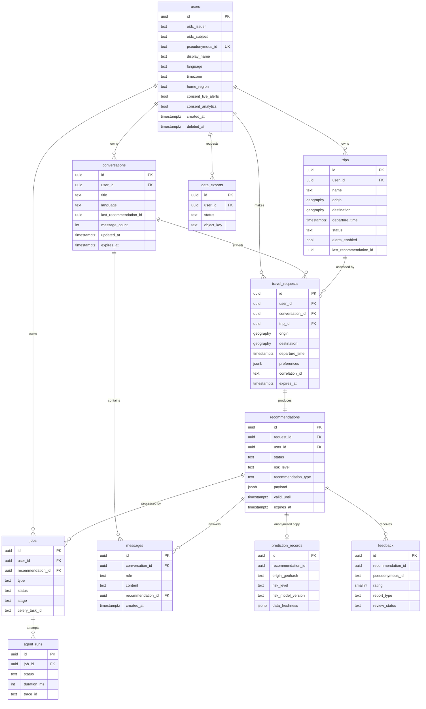

# 03 — Data Design: API & Backend

> สถานะ: **Draft v0.1** — ค่าตัวเลขอ้างอิง `P-xx` ใน [02_api_spec.md §2](02_api_spec.md#2-tunable-parameters)
> การตัดสินใจของ Phase นี้อยู่ที่ [§9 Decision Log](#9-decision-log) (ต่อจาก D-10)

---

## 1. หลักการ

| # | หลักการ |
|---|---|
| DP-01 | **PostgreSQL = source of truth**, Redis = ข้อมูลชั่วคราว (หายได้โดยระบบยังถูกต้อง) |
| DP-02 | **เก็บเท่าที่จำเป็น** — ทุกตารางที่มีข้อมูลผู้ใช้มี `expires_at` และถูกลบตาม retention |
| DP-03 | **แยกข้อมูลระบุตัวตนออกจากข้อมูล MLOps** — `prediction_records` และ `feedback` ไม่มี `user_id` ตรง ๆ |
| DP-04 | **ไม่เก็บ email / ชื่อจริง / token** — ใช้ `sub` จาก OIDC; email แสดงแบบ mask จาก token ตอน request |
| DP-05 | พิกัดใช้ `geography(Point, 4326)` (คำนวณระยะเป็นเมตรได้ตรง) + GiST index |
| DP-06 | ID เป็น UUIDv7 สร้างฝั่ง application; เวลาเป็น `timestamptz` (UTC) |
| DP-07 | Response ที่ sanitize แล้วเก็บเป็น `jsonb` ทั้งก้อน + ดึง field ที่ต้อง query ออกมาเป็น column |
| DP-08 | Schema เปลี่ยนผ่าน **Alembic migration เท่านั้น** |
| DP-09 | คอลัมน์ `jsonb` ใช้ `JSONB(none_as_null=True)` — Python `None` ต้องเป็น SQL `NULL` ไม่ใช่ JSON `null` (ไม่งั้น NOT NULL / `IS NOT NULL` ตรวจไม่เจอ) |

---

## 2. ER Diagram

ตารางอิสระ (ไม่ผูก FK กับผู้ใช้): `audit_logs`, `coverage_areas`, `emergency_defaults`

---

## 3. Table Specifications

> สัญลักษณ์: **PK** primary key · **FK** foreign key · **UK** unique · **N** nullable · 🔒 ข้อมูลอ่อนไหว

### 3.1 `users`

| Column | Type | Constraint | หมายเหตุ |
|---|---|---|---|
| `id` | `uuid` | PK | |
| `oidc_issuer` | `text` | not null | `iss` |
| `oidc_subject` | `text` | not null | `sub` |
| `pseudonymous_id` | `text` | UK, not null | `HMAC-SHA256(PSEUDONYM_SECRET, id)` — ใช้กับ Agent / feedback |
| `display_name` | `varchar(100)` | N | 🔒 |
| `language` | `varchar(35)` | not null, default `'th'` | BCP-47 |
| `timezone` | `varchar(64)` | not null, default `'Asia/Bangkok'` | IANA |
| `home_region` | `varchar(10)` | N | ISO 3166 เช่น `TH`, `TH-50` |
| `consent_live_alerts` | `boolean` | not null, default `false` | |
| `consent_live_alerts_at` | `timestamptz` | N | |
| `consent_analytics` | `boolean` | not null, default `false` | |
| `consent_analytics_at` | `timestamptz` | N | |
| `created_at`, `updated_at` | `timestamptz` | not null | |
| `last_seen_at` | `timestamptz` | N | ใช้หา inactive account |
| `deleted_at` | `timestamptz` | N | ตั้งค่าเมื่อขอลบ → purge job ลบจริง |

- **Unique:** `(oidc_issuer, oidc_subject)`
- Roles/scopes อ่านจาก JWT ทุกครั้ง **ไม่เก็บใน DB** (D-11)
- สร้าง user อัตโนมัติ (JIT provisioning) เมื่อเจอ `sub` ใหม่

### 3.2 `conversations`

| Column | Type | Constraint |
|---|---|---|
| `id` | `uuid` | PK |
| `user_id` | `uuid` | FK → `users.id` ON DELETE CASCADE |
| `title` | `varchar(200)` | N 🔒 |
| `language` | `varchar(35)` | not null |
| `last_request_id` | `uuid` | N, FK → `travel_requests.id` ON DELETE SET NULL |
| `last_recommendation_id` | `uuid` | N, FK → `recommendations.id` ON DELETE SET NULL |
| `message_count` | `integer` | not null, default 0 |
| `created_at`, `updated_at` | `timestamptz` | not null |
| `expires_at` | `timestamptz` | not null = `updated_at + P-22` |

- **Index:** `(user_id, updated_at DESC, id DESC)` — list + cursor
- `last_request_id` ใช้ merge `overrides` ของ follow-up (spec §7.1)
- FK วนกัน (`conversations` ↔ `travel_requests` ↔ `recommendations`) → สร้าง FK `last_*` ด้วย `use_alter=True` หลังสร้างตารางครบ

### 3.3 `messages`

| Column | Type | Constraint |
|---|---|---|
| `id` | `uuid` | PK |
| `conversation_id` | `uuid` | FK ON DELETE CASCADE |
| `role` | `varchar(16)` | CHECK in (`user`, `assistant`) |
| `content` | `text` | not null, CHECK `char_length ≤ 4000` 🔒 |
| `recommendation_id` | `uuid` | N, FK ON DELETE SET NULL |
| `created_at` | `timestamptz` | not null |

- **Index:** `(conversation_id, created_at DESC, id DESC)`
- `user` content ≤ `P-41`; `assistant` content คือ `summary` ของ recommendation (ยาวกว่าได้ จึงจำกัดที่ 4000)
- `content` เข้ารหัส (D-81) จึงเป็น `text` และความยาว 4000 ตรวจใน application (migration `0009` ลบ CHECK)
- ไม่มี `expires_at` แยก — ลบตาม conversation

### 3.4 `trips`

| Column | Type | Constraint |
|---|---|---|
| `id` | `uuid` | PK |
| `user_id` | `uuid` | FK ON DELETE CASCADE |
| `name` | `varchar(100)` | not null 🔒 |
| `origin` | `geography(Point,4326)` | not null 🔒 |
| `origin_name` | `varchar(200)` | N |
| `destination` | `geography(Point,4326)` | not null 🔒 |
| `destination_name` | `varchar(200)` | N |
| `waypoints` | `jsonb` | not null, default `[]` |
| `departure_time` | `timestamptz` | not null |
| `timezone` | `varchar(64)` | not null |
| `preferences` | `jsonb` | not null, default `{}` |
| `status` | `varchar(16)` | CHECK in (`PLANNED`, `ACTIVE`, `COMPLETED`, `CANCELLED`) |
| `alerts_enabled` | `boolean` | not null, default `false` |
| `alerts_consent_at` | `timestamptz` | N — CHECK: `alerts_enabled = false OR alerts_consent_at IS NOT NULL` |
| `alert_channels` | `text[]` | not null, default `{IN_APP}` |
| `last_recommendation_id` | `uuid` | N, FK ON DELETE SET NULL |
| `assessment_outdated` | `boolean` | not null, default `false` |
| `created_at`, `updated_at` | `timestamptz` | not null |
| `expires_at` | `timestamptz` | not null = `departure_time + P-47` |

- **Index:** `(user_id, departure_time DESC)`; partial `(departure_time) WHERE alerts_enabled AND status IN ('PLANNED','ACTIVE')` สำหรับ alert scheduler; GiST `(origin)`, `(destination)`

### 3.5 `travel_requests`

Request ที่ normalize แล้ว (หนึ่งแถวต่อหนึ่งครั้งที่ขอคำแนะนำ) — `id` = `request_id`

| Column | Type | Constraint |
|---|---|---|
| `id` | `uuid` | PK |
| `user_id` | `uuid` | FK ON DELETE CASCADE |
| `conversation_id` | `uuid` | N, FK ON DELETE SET NULL |
| `trip_id` | `uuid` | N, FK ON DELETE SET NULL |
| `source` | `varchar(24)` | CHECK in (`RECOMMENDATION`, `MESSAGE`, `TRIP_ASSESSMENT`, `TRIP_ALERT`) |
| `origin` | `geography(Point,4326)` | not null 🔒 |
| `origin_name` | `varchar(200)` | N |
| `destination` | `geography(Point,4326)` | not null 🔒 |
| `destination_name` | `varchar(200)` | N |
| `waypoints` | `jsonb` | not null, default `[]` |
| `departure_time` | `timestamptz` | not null |
| `timezone` | `varchar(64)` | not null |
| `language` | `varchar(35)` | not null |
| `preferences` | `jsonb` | not null |
| `has_question` | `boolean` | not null — ตัวคำถามเก็บใน `messages` เท่านั้น |
| `mode` | `varchar(8)` | CHECK in (`auto`, `sync`, `async`) |
| `cache_key` | `char(64)` | N — sha256 (spec §11.2) |
| `correlation_id` | `varchar(64)` | not null |
| `created_at` | `timestamptz` | not null |
| `expires_at` | `timestamptz` | not null = `created_at + P-21` |

- **Index:** `(user_id, created_at DESC)`, `(expires_at)`
- `Idempotency-Key` **ไม่เก็บใน DB** (อยู่ใน Redis ตาม P-25) — D-12

### 3.6 `recommendations`

| Column | Type | Constraint |
|---|---|---|
| `id` | `uuid` | PK |
| `request_id` | `uuid` | UK, FK → `travel_requests.id` ON DELETE CASCADE |
| `user_id` | `uuid` | FK ON DELETE CASCADE (denormalized สำหรับ ownership check + list) |
| `conversation_id` | `uuid` | N, FK ON DELETE SET NULL |
| `trip_id` | `uuid` | N, FK ON DELETE SET NULL |
| `status` | `varchar(24)` | CHECK in (`processing`, `completed`, `partial_result`, `needs_clarification`, `failed`, `cancelled`) |
| `risk_level` | `varchar(8)` | N, CHECK in (`LOW`, `MEDIUM`, `HIGH`) |
| `risk_score` | `numeric(4,3)` | N, CHECK 0–1 |
| `risk_confidence` | `numeric(4,3)` | N, CHECK 0–1 |
| `recommendation_type` | `varchar(24)` | N, CHECK in (`TRAVEL_NORMALLY`, `CHANGE_ROUTE`, `DELAY_TRAVEL`, `AVOID_TRAVEL`) |
| `origin_name`, `destination_name` | `varchar(200)` | N — denormalized สำหรับ history list |
| `departure_time` | `timestamptz` | not null — denormalized |
| `payload` | `jsonb` | N — `RecommendationResponse` ที่ sanitize แล้ว (null ระหว่าง `processing`) |
| `warning_codes` | `text[]` | not null, default `{}` |
| `safety_gate_rules` | `text[]` | not null, default `{}` — เช่น `{R-02}` |
| `overall_is_stale` | `boolean` | N |
| `valid_until` | `timestamptz` | N |
| `error_code` | `varchar(40)` | N |
| `api_version`, `agent_version`, `risk_model_version`, `prompt_version` | `varchar(64)` | N |
| `created_at` | `timestamptz` | not null |
| `completed_at` | `timestamptz` | N |
| `expires_at` | `timestamptz` | not null = `created_at + P-21` |

- **Index:**
  - `(user_id, created_at DESC, id DESC)` — history + cursor
  - `(user_id, risk_level, created_at DESC)` — filter `risk_level`
  - `(status) WHERE status = 'processing'` — หา job ค้าง
  - `(trip_id, created_at DESC) WHERE trip_id IS NOT NULL` — ผลประเมินของ trip และการ scan live alert (migration `0008`, D-71)
  - `(expires_at)` — purge
- **CHECK:** `status <> 'completed' OR payload IS NOT NULL`
- **CHECK (Safety):** `NOT (risk_level = 'HIGH' AND recommendation_type = 'TRAVEL_NORMALLY')` — กันระดับ DB อีกชั้น (R-04)
- `diagnostics` จาก Agent **ไม่อยู่ใน payload** (อยู่ `agent_runs`)

### 3.7 `jobs`

| Column | Type | Constraint |
|---|---|---|
| `id` | `uuid` | PK |
| `user_id` | `uuid` | FK ON DELETE CASCADE |
| `type` | `varchar(24)` | CHECK in (`RECOMMENDATION`, `MESSAGE`, `TRIP_ASSESSMENT`, `DATA_EXPORT`) |
| `recommendation_id` | `uuid` | N, FK ON DELETE CASCADE |
| `export_id` | `uuid` | N, FK → `data_exports.id` ON DELETE CASCADE |
| `status` | `varchar(16)` | CHECK in (`queued`, `running`, `succeeded`, `failed`, `cancelled`) |
| `stage` | `varchar(24)` | not null |
| `progress` | `smallint` | CHECK 0–100 |
| `celery_task_id` | `varchar(64)` | N |
| `attempts` | `smallint` | not null, default 0 |
| `error_code` | `varchar(40)` | N |
| `cancel_requested_at` | `timestamptz` | N |
| `created_at` | `timestamptz` | not null |
| `started_at`, `finished_at` | `timestamptz` | N |
| `expires_at` | `timestamptz` | not null = `created_at + P-21` |

- **Index:** `(user_id, created_at DESC)`, partial `(created_at) WHERE status IN ('queued','running')` สำหรับ reaper
- **CHECK:** `num_nonnulls(recommendation_id, export_id) = 1`
- Redis เก็บสถานะ live (§5); DB อัปเดตเฉพาะตอนเปลี่ยน `status` (ไม่เขียนทุก progress)

### 3.8 `agent_runs`

Diagnostics ของการเรียก Agent — ไม่มีข้อมูลส่วนบุคคล

| Column | Type | Constraint |
|---|---|---|
| `id` | `uuid` | PK (= `run_id` ที่ส่งให้ Agent) |
| `job_id` | `uuid` | FK ON DELETE CASCADE |
| `attempt` | `smallint` | not null |
| `status` | `varchar(16)` | CHECK in (`success`, `bad_response`, `timeout`, `error`, `cancelled`, `circuit_open`) |
| `http_status` | `smallint` | N |
| `error_code` | `varchar(40)` | N |
| `duration_ms` | `integer` | N |
| `tool_calls` | `smallint` | N |
| `agent_version` | `varchar(64)` | N |
| `trace_id` | `varchar(64)` | N |
| `started_at` | `timestamptz` | not null |
| `finished_at` | `timestamptz` | N |

- **Index:** `(job_id, attempt)` UK, `(started_at)`

### 3.9 `prediction_records` (MLOps)

สำเนาแบบ anonymized สำหรับ Data Feedback Loop / monitoring — **ไม่มี user_id, ไม่มีพิกัดละเอียด, ไม่มีข้อความ**

| Column | Type | Constraint |
|---|---|---|
| `id` | `uuid` | PK |
| `recommendation_id` | `uuid` | UK, **ไม่มี FK** (อยู่ได้หลัง recommendation ถูกลบ) |
| `origin_geohash` | `varchar(12)` | not null — precision `P-48` |
| `destination_geohash` | `varchar(12)` | not null |
| `region_code` | `varchar(10)` | N |
| `departure_bucket` | `timestamptz` | not null — ปัดเป็นชั่วโมง |
| `lead_time_hours` | `integer` | not null |
| `travel_modes` | `text[]` | not null |
| `status` | `varchar(24)` | not null |
| `risk_level` | `varchar(8)` | N |
| `risk_score` | `numeric(4,3)` | N |
| `risk_confidence` | `numeric(4,3)` | N |
| `recommendation_type` | `varchar(24)` | N |
| `hazard_types` | `text[]` | not null |
| `data_freshness` | `jsonb` | not null |
| `service_status` | `jsonb` | not null |
| `safety_gate_rules` | `text[]` | not null |
| `agent_version`, `risk_model_version`, `prompt_version` | `varchar(64)` | N |
| `created_at` | `timestamptz` | not null |
| `expires_at` | `timestamptz` | not null = `created_at + P-46` |

- **Index:** `(created_at)`, `(risk_model_version, created_at)`
- เขียนเฉพาะเมื่อ `users.consent_analytics = true` — *D-13*
- Worker เขียนหนึ่งแถวต่อผลสำเร็จของ Agent (ไม่เขียนเมื่อได้จาก cache หรือ fail); `region_code` = coverage area ของต้นทาง — *D-75*
- `recommendation_id` ใช้ join กับ `feedback` เท่านั้น

### 3.10 `feedback`

| Column | Type | Constraint |
|---|---|---|
| `id` | `uuid` | PK |
| `recommendation_id` | `uuid` | not null, **ไม่มี FK** (เหมือน 3.9) |
| `pseudonymous_id` | `text` | not null |
| `rating` | `smallint` | N, CHECK 1–5 |
| `helpful` | `boolean` | N |
| `outcome` | `varchar(16)` | CHECK in (`FOLLOWED`, `IGNORED`, `CHANGED_PLAN`, `UNKNOWN`) |
| `report_type` | `varchar(24)` | N, CHECK in (`UNSAFE_ADVICE`, `INCORRECT_INFO`, `OUTDATED_INFO`, `OTHER`) |
| `comment` | `text` (เข้ารหัส, ≤ 1000 ตัวอักษรตรวจใน application — migration `0009`) | N 🔒 |
| `review_status` | `varchar(16)` | CHECK in (`not_required`, `pending`, `approved`, `rejected`) |
| `reviewed_by` | `text` | N — `sub` ของ reviewer |
| `reviewed_at` | `timestamptz` | N |
| `review_note` | `varchar(1000)` | N |
| `usable_for_training` | `boolean` | not null, default `false` — true ได้เมื่อ `approved` เท่านั้น |
| `created_at` | `timestamptz` | not null |
| `expires_at` | `timestamptz` | not null = `created_at + P-23` |

- **Index:** `(recommendation_id)`, `(pseudonymous_id, created_at DESC)`, partial `(created_at) WHERE review_status = 'pending'`
- **CHECK:** `NOT usable_for_training OR review_status = 'approved'`
- Ownership ตอน POST ตรวจจาก `recommendations.user_id` (ต้องยังไม่ถูกลบ)

### 3.11 `data_exports`

| Column | Type | Constraint |
|---|---|---|
| `id` | `uuid` | PK |
| `user_id` | `uuid` | FK ON DELETE CASCADE |
| `status` | `varchar(16)` | CHECK in (`queued`, `running`, `ready`, `failed`, `expired`) |
| `object_key` | `text` | N — ที่อยู่ไฟล์ใน object storage |
| `expires_at` | `timestamptz` | N = `completed_at + P-49` |

- Step 5.9b: ไม่สร้างแถว `jobs` สำหรับ export — `data_exports.status` คือสถานะของงาน; ไฟล์อยู่ที่ `exports/{export_id}.zip`; หมดอายุ → ลบไฟล์, `object_key = NULL`, `status = expired`; ค้างเกิน 30 นาที → reaper ตั้ง `failed` (D-82)
| `created_at`, `completed_at` | `timestamptz` | |

### 3.12 `audit_logs` (append-only)

| Column | Type | Constraint |
|---|---|---|
| `id` | `bigint` | PK identity |
| `occurred_at` | `timestamptz` | not null |
| `actor_type` | `varchar(16)` | CHECK in (`user`, `admin`, `system`) |
| `actor_ref` | `text` | not null — `sub` หรือชื่อ job |
| `action` | `varchar(64)` | not null — เช่น `feedback.review`, `user.delete`, `export.training_data` |
| `target_type` | `varchar(32)` | N |
| `target_id` | `text` | N |
| `result` | `varchar(16)` | CHECK in (`success`, `denied`, `error`) |
| `correlation_id` | `varchar(64)` | not null |
| `ip_hash` | `char(64)` | N — HMAC ของ IP |
| `metadata` | `jsonb` | not null, default `{}` — ห้ามมี PII |

- **Partition:** `RANGE (occurred_at)` รายเดือน — ลบทีละ partition ตาม `P-24`
- สิทธิ์ DB: app role มีแค่ `INSERT`, `SELECT` (ไม่มี `UPDATE`/`DELETE`); purge ใช้ role แยก

### 3.14 `training_exports` (MLOps, Step 5.11)

ไฟล์ข้อมูลสำหรับ retraining ที่ admin สั่ง — **ไม่ผูกกับผู้ใช้** — *D-92*

| Column | Type | Constraint |
|---|---|---|
| `id` | `uuid` | PK |
| `requested_by` | `text` | not null — `sub` ของ admin |
| `status` | `varchar(16)` | CHECK in (`queued`, `running`, `ready`, `failed`, `expired`) |
| `range_from`, `range_to` | `timestamptz` | not null, CHECK `range_from < range_to` — ช่วง `prediction_records.created_at` |
| `row_count` | `integer` | N |
| `object_key` | `text` | N — `training/{id}.jsonl.gz` |
| `created_at`, `completed_at` | `timestamptz` | |
| `expires_at` | `timestamptz` | N = `completed_at + P-68` (อายุไฟล์) |

- **Index:** `(created_at)`, `(expires_at)`
- ไฟล์ = gzip JSON Lines หนึ่งบรรทัดต่อ `prediction_records` ในช่วงนั้น + feedback ที่ `usable_for_training` (rating, helpful, outcome, report_type) — ไม่มี `recommendation_id`, `pseudonymous_id`, comment
- purge ลบไฟล์เมื่อหมดอายุแล้วตั้ง `expired` (แถวเก็บไว้เป็นประวัติ ไม่มีข้อมูลผู้ใช้); ค้างเกิน 30 นาที → reaper ตั้ง `failed`

### 3.13 Reference Tables

**`coverage_areas`** — ใช้ตรวจ `UNSUPPORTED_REGION`

| Column | Type |
|---|---|
| `code` | `varchar(10)` PK |
| `name` | `varchar(100)` |
| `area` | `geography(MultiPolygon,4326)` + GiST |
| `active` | `boolean` |

**`emergency_defaults`** — ใช้เติมตาม R-01 (เจ้าของข้อมูลรอสรุป — Open Q4 ใน spec)

| Column | Type |
|---|---|
| `region_code` | `varchar(10)` PK part |
| `language` | `varchar(35)` PK part |
| `instructions` | `jsonb` (`EmergencyInstructions`) |
| `source` | `text` |
| `verified_at` | `timestamptz` |

---

## 4. Query Patterns → Index

| Use case | Query | Index |
|---|---|---|
| Ownership check | `WHERE id = :id AND user_id = :uid` | PK (+ filter) |
| History list (E-02) | `WHERE user_id = :uid AND (created_at, id) < (:c_at, :c_id) ORDER BY created_at DESC, id DESC LIMIT :n` | `recommendations (user_id, created_at DESC, id DESC)` |
| Conversation messages (E-12) | เหมือนข้างบนบน `messages` | `messages (conversation_id, created_at DESC, id DESC)` |
| Follow-up context (P-45) | 10 ข้อความล่าสุด | index เดียวกัน |
| Coverage check | `ST_Covers(area, :point)` | GiST `coverage_areas.area` |
| Trip alert scheduler | trips ที่เปิด alert และใกล้ออกเดินทาง | partial index 3.4 |
| Trip assessments (E-18), assessment ที่ยังค้าง | `WHERE trip_id = :tid ORDER BY created_at DESC` | `recommendations (trip_id, created_at DESC)` |
| Safety review queue | `WHERE review_status = 'pending' ORDER BY created_at, id` | partial index 3.10 |
| Admin: jobs ตามช่วงเวลา (Step 5.11) | `WHERE created_at >= :from AND created_at < :to [AND status/type] ORDER BY created_at DESC, id DESC` | `jobs (created_at DESC, id DESC)` (migration `0010`, D-93) |
| Admin: audit log | `WHERE occurred_at` ในช่วง (ตัด partition) + filter `ORDER BY occurred_at DESC, id DESC` | `(occurred_at)` ของแต่ละ partition |
| Stuck job reaper | `status IN ('queued','running') AND created_at < now() - P-04*2` | partial index 3.7 |
| Retention purge | `WHERE expires_at < now() LIMIT 1000` (วนเป็น batch) | `(expires_at)` ทุกตาราง |
| Safety review queue | `review_status = 'pending' ORDER BY created_at` | partial index 3.10 |

**Cursor format:** base64url ของ `{"t": created_at, "id": id}` (ไม่เข้ารหัส แต่ validate รูปแบบ)

---

## 5. Redis Key Design

### 5.1 แยก Instance ตามพฤติกรรม eviction — *D-14*

| Instance | `maxmemory-policy` | Persistence | ใช้กับ |
|---|---|---|---|
| `redis-core` | `noeviction` | AOF everysec | Celery broker, idempotency, rate limit, jobs, SSE events, tickets |
| `redis-cache` | `allkeys-lru` | ไม่มี | recommendation cache, JWKS, service status, ready check |

> dev ใช้ instance เดียวแยก logical DB ได้ (`/0` core, `/1` cache, `/2` Celery)

### 5.2 Keys

ทุก key ขึ้นต้นด้วย prefix `tsa:{env}:` (เช่น `tsa:dev:`) — ตารางด้านล่างละ prefix ไว้

| Key | Type | TTL | Instance | ใช้ทำอะไร |
|---|---|---|---|---|
| `rl:user:{user_id}` | ZSET | window + 1 s | core | rate limit P-30 |
| `rl:ip:{ip_hash}` | ZSET | window + 1 s | core | P-31 |
| `rl:user:{user_id}:recommend` | ZSET | window + 1 s | core | P-32 |
| `rl:user:{user_id}:export` | STRING | 24 h | core | 1 ครั้ง/วัน |
| `idem:{user_id}:{method}:{route}:{key}` | HASH `{body_hash, state, status, response, created_at}` | P-25 | core | spec §11.1 |
| `job:{job_id}` | HASH `{user_id, status, stage, progress, result_ref, error_code, updated_at}` | P-05 | core | live status (E-04 อ่านที่นี่ก่อน DB) |
| `job:{job_id}:events` | STREAM (`MAXLEN ~ 100`) | P-05 | core | SSE + resume ด้วย `Last-Event-ID` = stream entry id; API ที่รอแบบ sync ก็อ่านที่นี่ (D-38) |
| `jobs:active:{user_id}` | ZSET (member = job id, score = expiry) | P-04 × 2 | core | P-33 (D-39) |
| `streams:{user_id}` | ZSET (member = connection id, score = expiry) | P-35 × 3 | core | P-34 (ลบ member ที่หมดอายุได้แม้ connection หลุด) |
| `sse:ticket:{sha256(ticket)}` | STRING (JSON `{user_id, job_id}`) | P-54, ใช้ครั้งเดียว (`GETDEL`) | core | D-06, D-40 |
| `ws:auth-pending:{conn}` | STRING | 5 s | core | timeout ของ auth message |
| `cb:agent` | HASH `{state, failures, opened_at}` | ไม่มี | core | circuit breaker P-08 (ใช้ร่วมทุก worker) |
| `reco:{cache_key}` | STRING (JSON ไม่มี PII) | min(P-26, valid_until) | cache | spec §11.2 |
| `jwks:{issuer_hash}` | STRING | P-11 | cache | |
| `status:reports` | HASH `{service: "state\|reported_at_ms"}` | P-64 (ต่ออายุทุกครั้งที่เขียน) | cache | สถานะล่าสุดของ service ที่ Agent รายงาน (worker เขียน, E-23 อ่าน; ไม่เขียนค่า `not_used`) |
| `status:service` | STRING (JSON สรุปสถานะ) | P-65 (30 s) | cache | E-23 |
| `ready:agent` | STRING (`ok` / `unavailable`) | P-66 (10 s) | cache | `/ready` และ E-23 |
| `lock:purge:{table}` | STRING (`SET NX PX`) | 10 min | core | กัน purge job ซ้อน |

### 5.3 กติกา

- ห้ามเก็บ JWT, email, ข้อความผู้ใช้ หรือพิกัดละเอียดใน key name
- IP ใช้ `ip_hash` = HMAC(IP) ไม่ใช่ IP ดิบ
- ทุก key ต้องมี TTL ยกเว้น `cb:agent`
- ระบบต้องทำงานถูกต้องเมื่อ `redis-cache` ว่างเปล่า; ถ้า `redis-core` ล่ม → `/ready` = 503

---

## 6. Data Lifecycle & Retention

| ข้อมูล | ที่เก็บ | อายุ | เมื่อหมดอายุ |
|---|---|---|---|
| travel_requests, recommendations, jobs, agent_runs | DB | P-21 (30 วัน) | hard delete (cascade) |
| conversations + messages | DB | P-22 (30 วันนับจากใช้ล่าสุด) | hard delete |
| trips | DB | departure + P-47 (30 วัน) | hard delete |
| feedback | DB | P-23 (180 วัน) | hard delete |
| prediction_records | DB | P-46 (365 วัน) | hard delete |
| audit_logs | DB | P-24 (365 วัน) | drop partition |
| data_exports (ไฟล์) | Object storage | P-49 (7 วัน) | ลบไฟล์ + `status=expired` |
| Redis keys | Redis | ตามตาราง §5.2 | TTL |

### 6.1 Purge Job (Celery beat)

- รันทุกวัน 03:00 ตาม `P-50` timezone
- ลบทีละ batch 1,000 แถว (`DELETE ... WHERE id IN (SELECT id ... WHERE expires_at < now() LIMIT 1000)`) จนหมด เพื่อไม่ล็อกตารางนาน
- ลำดับ: `recommendations` → `travel_requests` → `conversations` → `trips` → `feedback` → `prediction_records` → `data_exports` → partition `audit_logs`
- บันทึกจำนวนที่ลบใน `audit_logs` (`actor_type=system`)
- Step 5.9b (D-85): beat ใช้ cron P-50 ในเขตเวลา `PURGE_TIMEZONE`; กันรันซ้อนด้วย Redis `lock:purge` (10 นาที); ลำดับจริง `recommendations` → `travel_requests` → `jobs` → `conversations` → `trips` → `feedback` → `prediction_records` → ไฟล์ export ที่หมดอายุ → partition audit; สร้าง partition `audit_logs_yYYYYmMM` ของเดือนนี้และอีก 2 เดือนล่วงหน้า (ย้ายแถวของเดือนนั้นออกจาก default partition ก่อน attach), drop partition ที่จบก่อน `now - P-24` และลบแถวเก่าใน default partition; audit `retention.purge` เก็บแค่จำนวน

### 6.2 Account Deletion (`DELETE /v1/me`)

1. ตั้ง `users.deleted_at`, revoke job ที่ค้าง, ลบ Redis keys ของ user
2. Celery task:
   - `feedback`: ตั้ง `comment = NULL`, `pseudonymous_id = 'deleted'` (ข้อมูล rating ยังใช้ได้แบบไม่ระบุตัวตน)
   - `DELETE FROM users WHERE id = :id` → cascade ลบ conversations, messages, trips, requests, recommendations, jobs, exports
   - `prediction_records` คงอยู่ (ไม่มีข้อมูลระบุตัวตนตั้งแต่ต้น)
3. `audit_logs` บันทึก `user.delete` (actor_ref เป็น `pseudonymous_id` ไม่ใช่ `sub`)

ที่ทำจริงใน Step 5.9a (D-78, D-79): ไม่ใช้ Celery revoke (job ถูก `cancelled` ใน DB แล้ว worker หยุดเอง); Redis ที่ลบ = `jobs:active`, `streams`, `job:{id}` / `job:{id}:events` ของ job ใน P-05 ล่าสุด และ `idem:{principal_hash}:*`; task ชื่อ `delete_account` (queue `maintenance`) รันซ้ำได้; reaper ส่งงานลบใหม่เมื่อค้างเกิน P-61; audit มี `user.delete_requested` (actor `user`) และ `user.delete` (actor `system`)

### 6.3 Data Export (`POST /v1/me/data-export`)

รวม `users`, `conversations` + `messages`, `trips`, `recommendations` (payload), `feedback` ของ `pseudonymous_id` → JSON zip → object storage → signed URL

ทำจริงใน Step 5.9b: MinIO ใน docker compose (S3 API, image จาก quay.io); ลิงก์เซ็นด้วย client ที่ตั้งเป็น public URL เพราะ signature ผูกกับ host; ลบบัญชีแล้วลบไฟล์ export ด้วย (D-84)

---

## 7. Security ระดับ Database

| หัวข้อ | กติกา |
|---|---|
| DB roles | `tsa_migrator` (DDL), `tsa_app` (DML ยกเว้น UPDATE/DELETE บน audit_logs), `tsa_purge` (DELETE), `tsa_readonly` (analytics — เห็นแค่ `prediction_records` + `feedback` ที่ `usable_for_training`) |
| Connection | TLS บังคับ (`sslmode=verify-full` ใน prod) |
| Encryption at rest | ระดับ disk/volume ของ provider; column encryption สำหรับ `messages.content`, `feedback.comment` — *D-15* |
| Column encryption (ทำใน 5.9b) | AES-256-GCM ใน application: `enc:v1:<key id>:<base64(nonce + ciphertext)>`, ชื่อ column เป็น associated data; key จาก `COLUMN_ENCRYPTION_KEYS` (key แรก = active, ที่เหลืออ่านได้อย่างเดียวเพื่อหมุน key); ค่าที่ไม่มี prefix = ข้อความเดิมก่อนเข้ารหัส; prod ต้องตั้ง key — *D-81* |
| Secrets | `PSEUDONYM_SECRET`, `IP_HASH_SECRET` อยู่ใน secret manager; เปลี่ยน secret = pseudonym เปลี่ยน (ต้องมีแผน rotate) |
| Row ownership | บังคับใน repository layer ทุก query (`user_id = :current_user`) — Row Level Security เป็นทางเลือกในอนาคต |
| Backup | daily snapshot + PITR 7 วัน; backup ลบตามอายุเอง (ข้อมูลที่ user ลบจะหายจาก backup ภายใน 7 วัน) |

---

## 8. Migrations

- Alembic + SQLAlchemy naming convention (`pk_%(table_name)s`, `fk_%(table_name)s_%(column_0_name)s_%(referred_table_name)s`, `ix_...`, `uq_...`, `ck_...`)
- Migration แรก: `CREATE EXTENSION IF NOT EXISTS postgis;`
- ลำดับ revision ที่เสนอ:
  1. `0001_extensions`
  2. `0002_users`
  3. `0003_conversations_trips_requests_recommendations_messages`
  4. `0004_jobs_agent_runs_exports`
  5. `0005_mlops_feedback`
  6. `0006_audit_logs_partitioned`
  7. `0007_reference_tables`
  8. `0008_recommendation_trip_index` (Step 5.8)
  9. `0009_encrypt_free_text` (Step 5.9b: เข้ารหัสแถวเดิม; โหมด offline SQL ข้ามขั้นนี้)
  10. `0010_admin_training_exports` (Step 5.11: ตาราง `training_exports` + index `ix_jobs_recent`)
- กติกา: migration ต้อง backward compatible อย่างน้อย 1 version (expand → migrate → contract); สร้าง index ใหญ่ด้วย `CONCURRENTLY`
- Seed: `coverage_areas` (TH) และ `emergency_defaults` (TH/th, TH/en) ผ่าน data migration หรือ script แยก

---

## 9. Decision Log

| ID | การตัดสินใจ (ปัจจุบัน) | ทางเลือกอื่น | สถานะ |
|---|---|---|---|
| D-11 | Roles อ่านจาก JWT ไม่เก็บใน DB | ตาราง `user_roles` | Proposed |
| D-12 | Idempotency อยู่ใน Redis อย่างเดียว | เก็บใน DB ด้วย (ทนต่อ Redis ล่ม) | Proposed |
| D-13 | `prediction_records` เขียนเฉพาะผู้ใช้ที่ยินยอม analytics | เขียนทุกคน (ข้อมูล anonymized แล้ว) | Proposed |
| D-14 | Redis แยก 2 instance (core / cache) | instance เดียว | Proposed |
| D-15 | Column encryption สำหรับ message/comment | disk encryption อย่างเดียว | Accepted (Step 5.9b, ดู D-81) |
| D-16 | เก็บ response เป็น `jsonb` ทั้งก้อน ไม่แยกตาราง hazards/routes | normalize เป็นตาราง (query เชิงพื้นที่ได้) | Proposed |
| D-17 | Hard delete เมื่อหมดอายุ | soft delete + archive | Proposed |

## 10. Tunable Parameters ที่เพิ่มใน Phase นี้

> เพิ่มเข้าตาราง [02_api_spec.md §2](02_api_spec.md#2-tunable-parameters) แล้ว

| ID | Parameter | ค่าเสนอ |
|---|---|---|
| P-46 | Retention: prediction_records | 365 วัน |
| P-47 | Retention: trips หลังวันเดินทาง | 30 วัน |
| P-48 | Geohash precision ใน prediction_records | 5 ตัว (~5 km) |
| P-49 | อายุไฟล์ data export | 7 วัน |
| P-50 | เวลารัน purge job | 03:00 Asia/Bangkok |

## 11. Open Questions (Phase 3)

1. Object storage สำหรับ data export ใช้อะไร (MinIO ใน Docker สำหรับ dev?)
2. ทีม MLOps ต้องการ `prediction_records` รูปแบบไหน (ตารางใน DB เดียวกัน / export เป็นไฟล์ / event stream)
3. ต้องทำ query เชิงพื้นที่กับ hazards ย้อนหลังหรือไม่ (ถ้าใช่ → ทบทวน D-16)
4. ยอมรับการลบ backup ภายใน 7 วันหลังผู้ใช้ขอลบได้หรือไม่ (PDPA)

## 12. Change Log

| Version | วันที่ | รายละเอียด |
|---|---|---|
| 0.1 | 2026-09-17 | Draft แรก |
| 0.9 | 2026-09-18 | Step 5.11: ตาราง `training_exports` (§3.14), index `jobs (created_at DESC, id DESC)`, migration `0010`, query ของ admin (§4) |
| 0.8 | 2026-09-18 | Step 5.10: ไม่เปลี่ยน schema; Redis key `status:reports` และรายละเอียด `status:service` / `ready:agent` (§5.2) |
| 0.7 | 2026-09-18 | Step 5.9b: migration `0009` (column encryption), partition audit รายเดือนสร้างตอน runtime, รายละเอียด purge / export |
| 0.6 | 2026-09-18 | Step 5.9a: ไม่เปลี่ยน schema; ใช้ `jobs.cancel_requested_at`, `users.deleted_at`, `users.consent_*`, `prediction_records`; รายละเอียดการลบบัญชีใน §6.2 |
| 0.5 | 2026-09-17 | Step 5.8: index `recommendations (trip_id, created_at DESC)` (migration 0008); การประเมิน trip ใช้ `source = TRIP_ASSESSMENT` / `TRIP_ALERT` และ `jobs.type = TRIP_ASSESSMENT`; audit log ลง default partition จนกว่า 5.9 จะสร้าง partition รายเดือน |
| 0.4 | 2026-09-17 | Step 5.7: ไม่เปลี่ยน schema; follow-up ใช้ `travel_requests.source = MESSAGE` และ `jobs.type = MESSAGE` |
| 0.3 | 2026-09-17 | Step 5.6: ตัด `job:{id}:done` (D-38), `jobs:active` เป็น ZSET (D-39), ชื่อ key ของ ticket เป็น hash (D-40) |
| 0.2 | 2026-09-17 | Step 5.2: เพิ่ม DP-09, `coverage_areas.source`, `data_exports.expires_at` nullable, audit_logs มี default partition, roles ย้ายไปทำตอน deploy (D-27) |
